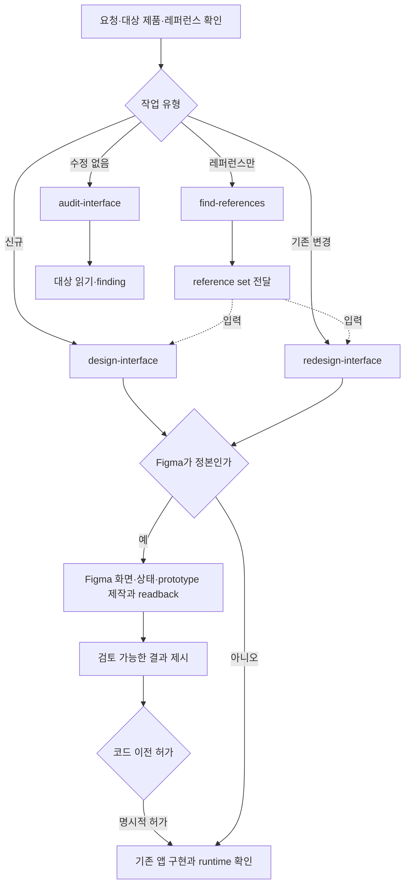

# UI 디자인 작업 구조

`design` 하나가 신규 설계, 재설계, 읽기 전용 감사와 레퍼런스 검색을 담당합니다. 공개 스킬은
`design-interface`, `redesign-interface`, `audit-interface`, `find-references`입니다. 일반 UI와
운영 UI의 차이는 도메인 계약으로, Figma와 코드의 차이는 실행 경로로 다룹니다.

모든 경로는 대상 앱의 가장 가까운 Google 형식 `DESIGN.md`, 제품 component·token,
실제 사용자 과업을 읽습니다. 새 설계·재설계는 문서를 작성·갱신하고 공통 명령으로 검증합니다.
읽기 전용 감사는 문서를 수정하지 않습니다. 레퍼런스의 시각 구성과 실제 제품 값·상태·기능을
구분하고, 기존 제품 동작은 보존 또는 명시적 변경으로 추적합니다.

레퍼런스 검색은 [레퍼런스 검색 계약](../../plugins/design/references/reference-search.md)을
따릅니다. `find-references`는 검색·선별·기록만 하고, 설계·재설계 작업은 사용자가 요청하거나
동의했을 때 같은 계약을 직접 적용해 `extensions.references`에 기록합니다. 공급자는 현재 세션의
도구 자격으로 고르며, 전용 MCP나 Research 플러그인이 없어도 호스트 웹 검색이나
`no_verified_match`로 끝납니다. 설계·재설계는 사용자 레퍼런스나 `find-references` 결과를 입력으로
primary와 차용 범위를 잠그고, 공통 절차는 `borrow`만 제품 token·component로 다시 표현합니다. 검증은
결과를 primary와 대조해 `do_not_borrow`와 레퍼런스의 실제 값이 옮겨지지 않았는지 확인하고, 감사는
레퍼런스와의 차이만으로 finding을 만들지 않습니다. 여러 단계 작업은 reference set 위치와 차용 범위를
작업 연속성 기록에 보존합니다. 레퍼런스는 DQ gate나 사용자 결과의 근거가 아닙니다.

운영 업무이면 [Operations 계약](../../plugins/design/references/operations/screen-contract.md)의
requirement↔scenario, action·permission·risk·state, 부분 실패·복구를 적용합니다. Figma 경로는
[공식 도구·native 증거](../../plugins/design/references/figma/workflow.md)를 사용합니다.
Figma에서 코드로 옮기기 전에는 실제 결과의 범위와 revision에 대한 명시적 허가가 필요합니다.
직접 코드 경로는 기존 프로젝트의 UI를 구현하고 실제 화면·대표 조작을 확인합니다.

공통 DQ 계약의 `profile` 값은 기존 저장된 계약·리포트 호환성을 위해 이번 구조 정리에서는
유지합니다. 공개 스킬 선택 기준이 아니며, Figma 산출물에는 Figma receipt를, 운영 업무에는
Operations 확장을 적용합니다. DQ 임계치와 세부 품질 개선은 별도 작업으로 다룹니다.
