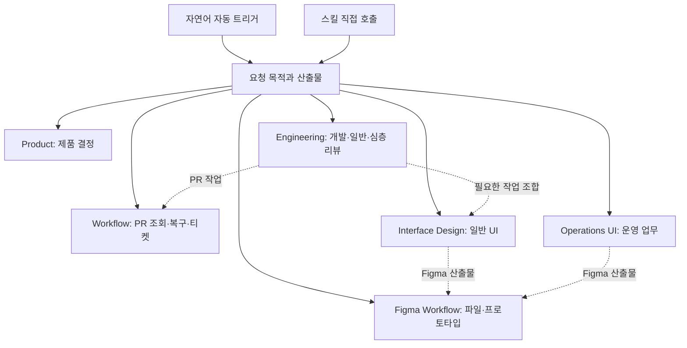

# 독립 스킬과 디자인 책임

자연어 요청은 각 스킬의 description에 따라 자동 선택하고 명시적 호출은 우선합니다.
스킬 선택과 수정·게시 권한은 구분합니다. 별도의 만능 router나 필수 plugin dependency는 없습니다.

실선은 선택, 점선은 요청에 따른 조합입니다. 다른 플러그인 설치를 요구하는 import 관계가 아닙니다.
일반 리뷰는 `review-quality`, 명시적인 심층·다중 PR 리뷰는 `review-pr`입니다. PR URL만으로
심층 검토하지 않습니다. 일반 UI는 Interface Design, 운영 업무는 Operations UI, Figma 파일
자체의 구조 편집은 Figma Workflow가 중심이며 혼합 요청의 명세·결과 담당은 하나로 둡니다.

## 디자인의 세 축

| 축 | 선택 |
| --- | --- |
| 과업 | 읽기·탐색·입력·비교·반복 업무·대량 처리 |
| 플랫폼 | 웹·iOS·Android·창 크기·키보드·터치 |
| 산출물 | 제안·Figma·기존 프로젝트 구현 |

플랫폼만으로 밀도를, B2B라는 이름만으로 테이블을 결정하지 않습니다. 과업·의미 → 정보 구조·
공간 → 시각 체계·정보 자산 → 상태·흐름 → 실제 검증으로 진행합니다. 지도·차트 내부의 표현은
전체 레이아웃과 따로 확인하고 실패 원인이 있는 단계로 돌아갑니다.

## 정본과 완료 범위

일반 디자인 상세 절차는 Interface Design, 운영 업무 기준은 Operations UI, Figma native 제작은
Figma Workflow가 소유합니다. 전문 본문 전체를 복제하거나 설치 경로를 하드코딩하지 않습니다.
각 플러그인의 단독 실행에 필요한 최소 계약은 그 안에 유지합니다.

Figma에서는 component·variable·Auto Layout·state·reaction이 정본이고 텍스트는 결정과 제약을
보충합니다. 제안/Figma-only에는 구현용 Screen Contract JSON·G0–G7을 강제하지 않습니다.
Operations UI 웹 구현의 기존 schema·validator·runtime gate는 유지합니다.

스킬 발견, 명시적 지침 적용, 자동 선택과 결과 품질은 다른 검증입니다. 이전 차량 화면의 이미지
실험을 신규 웹·모바일·운영 화면의 범용성 증거로 확대하지 않습니다.

## PR 심층 리뷰 구성

`engineering:review-pr`의 기본은 Luna xhigh 5명과 Astra xhigh 1명입니다. 조정자가 새 세션의
리뷰어를 직접 생성하고 슬롯이 충분하면 병렬로 실행합니다. 모든 리뷰어가 같은 고정 전체 diff를
독립 검토하며 재위임하지 않습니다. 사용자 지정은 우선하고, 슬롯 부족 시 독립성을 유지한 채 나눠
실행합니다. 조정자는 원인·발생 조건·필요한 수정이 같은 지적을 한 번만 보고합니다.
전역 동시 상한과 메모리 주입은 호스트 책임이며 스킬이 설정을 자동으로 바꾸지 않습니다.
