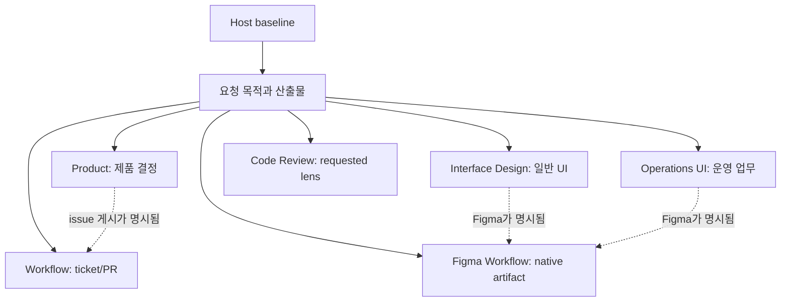

# 독립 스킬과 디자인 책임

자연어 요청은 각 skill description의 직접 목적과 산출물에 따라 선택하고 명시적 호출을 우선합니다.
skill 선택과 수정·게시 권한은 분리합니다. 만능 router나 plugin dependency는 없습니다.

실선은 primary ownership, 점선은 사용자가 두 산출물을 요청한 경우의 runtime composition입니다.
일반 구현·디버깅·test는 host baseline이며 Engineering plugin이 없습니다.

## 디자인의 세 축

| 축 | 선택 |
| --- | --- |
| 과업 | 읽기·탐색·입력·비교·반복 업무·대량 처리 |
| 플랫폼 | 웹·iOS·Android·창 크기·키보드·터치 |
| 산출물 | 제안·Figma·기존 프로젝트 구현 |

플랫폼만으로 밀도를, B2B라는 이름만으로 table을 결정하지 않습니다. 과업·의미 → 정보 구조·공간 →
시각 체계·정보 자산 → 상태·흐름 → 실제 surface 검증으로 진행합니다.

## 책임 경계

- Interface Design: 일반 웹·앱의 proposal/implementation 설계와 재설계.
- Operations UI: 상태 판단, 반복 작업, 권한, 위험 행동과 고밀도 데이터가 중심인 운영 화면.
- Figma Workflow: Figma native component, variable, Auto Layout, state와 reaction.
- Product: 사용자 문제, evidence, domain rule, experiment와 PRD. UI를 대신 설계하지 않습니다.
- Design Patterns: 실제 forces가 있을 때의 named pattern. UI 품질이나 일반 구현을 대신하지 않습니다.

세 UI/Figma package는 같은 Design Decision Contract와 DQ0–DQ8 vocabulary를 package 내부에 포함하지만
proposal, Figma, implementation, live scope를 구분합니다. DQ1–DQ6는 한 author run과 관계를 명시한
최소 한 evaluator score로 판정할 수 있습니다. 여러 evaluator가 있으면 minimum score를 사용하고
finding 불일치는 `inconclusive`입니다.

## Host-specific Figma boundary

Codex의 Figma `apps` metadata는 `figma-workflow` manifest에만 있습니다. OMP는 current host가 노출한
official Figma MCP/plugin capability를 사용합니다. hard-coded skill ID는 실제 registry에 있을 때만
적용합니다. capability나 write permission이 없으면 API 또는 다른 writer를 추정하지 않고 필수
artifact는 `blocked`, 선택 작업은 `not_run`으로 남깁니다.

## PR review boundary

일반 code review는 host-native review입니다. `code-review:review-pr`은 explicit 호출에서만 정확히
세 fresh reviewer가 같은 pinned diff를 별도 clean detached checkout에서 검토하고, coordinator가
중복을 제거한 뒤 한 COMMENT를 게시합니다. 고정 model 이름이나 reasoning level은 없고 current host
설정을 상속합니다.
