# brainstorming: 아이디어를 설계로 구체화하기

자연스러운 협업 대화를 통해 아이디어를 완성된 설계와 spec으로 구체화한다.

먼저 요청과 이전 대화에서 승인된 범위를 확인한 뒤 필요한 process의 정도를 분류한다.
context를 이해하고 설계를 제시하되, 사용자가 결정해야 하는 사항과 내부 구현 선택을 구분한다.

<HARD-GATE>
사용자의 현재 요청과 이전 승인을 기준으로 실행 범위를 판단한다. 구현 요청이 있고 목표·관찰
가능한 결과·제약이 충분하면 기존 코드와 관례에 따른 내부 구현 선택은 설명하고 진행한다.
별도의 설계 승인 대화가 없다는 이유만으로 이미 승인된 조사·계획·수정·검증을 중단하지 않는다.

현재 요청이 설계·검토만 포함하거나 아직 충족되지 않은 구현 전 확인 조건이 있으면 해당
산출물까지만 준비한다. 이후 승인으로 충족된 조건을 다시 열지 않는다.
미결정 제품 규칙, 서로 충돌하는 요구사항 또는 승인된 목표·설계·관찰 가능한 계약을 바꿀
결정에는 사용자 확인이 필요하다. 해당 결정에 의존하는 작업을 보류하고 확인할 내용을 제시한다.
독립적으로 수행할 수 있는 승인된 작업은 계속한다. 답이 없다는 사실을 승인으로 취급하지 않는다.

작업 복잡도, Fast Path 적합성, plan 필요 여부와 품질 판정은 실행 권한을 부여하거나 취소하지
않는다. Git·배포·외부 쓰기와 명시적인 사용자 확인 조건에는 각각 해당 권한 경계를 적용한다.
</HARD-GATE>

## 작업 연속성

현재 메인 controller가 여러 단계의 작업을 소유하거나 외부 쓰기를 수행할 때에는 같은 플러그인의
[task-continuity](../task-continuity/SKILL.md)를 적용해 시작·중요한 진행 변화·외부 쓰기 전후를 기록한다.
컴팩션·재개 후에는 그 기록과 현재 근거를 대조한다. 짧은 단발 작업, 위임된 subagent와 fresh reviewer는
별도 기록을 만들지 않으며, 파일 쓰기가 금지되면 checkpoint와 Git exclude도 변경하지 않는다.

## 세 가지 경로

첫 질문 전에 요청을 분류하고 "이 작업은 `bounded`로 보이므로 spec을 작성하지 않고 여기에서
짧은 설계를 제시하겠습니다"처럼 분류를 사용자에게 알린다. 그래야 사용자가 다른 경로를
선택할 수 있다.

- **Spike** — 유지할 코드가 아니라 답을 산출하는 feasibility 질문("can we...", "is it
  possible...", "quick and dirty is fine")이다. 질문과 확인할 내용을 2-3문장으로 제시하고
  요청된 조사 범위에서 정확성이 허용하는 가장 저렴한 방법으로 알아본다. 새로운 실행 권한이나
  사용자 결정이 필요할 때만 의존하는 probe를 보류한다. design doc이나 spec 파일은
  만들지 않는다. finding을 권고안으로 보고하고, 만든 것이 있다면 폐기용이라고 표시한다.
- **Bounded** — 이 저장소에 이미 존재하는 코드를 대상으로 범위가 명확한 변경이다. 새 flag,
  작은 endpoint, 한 파일 수정 등이 해당한다. 앱의 종류를 이해한다는 것만으로는 부족하다.
  `bounded`는 변경할 흐름이 이미 존재하여 읽을 수 있다는 뜻이다. 변경할 기존 흐름이 없다면
  `bounded`가 아니다. 먼저 아래 Fast Path를 판정한다. 해당하지 않으면 필요한 탐색을 수행하고,
  결과를 바꾸는 미결정 사항이 있을 때만 명확화한다. chat 안에서 짧은 설계를 제시하고 위 권한
  경계 안에서 계속한다. spec 파일은 만들지 않는다.
  `engineering:writing-plans`의 plan 필요 조건을 별도로 확인하고, 조건을 충족하면 의사코드 우선
  plan으로 전환한다. 조건을 충족하지 않을 때에만 별도 plan 없이 직접 구현한다.
- **Architectural** — 새 project, 새 subsystem, component 사이의 구성을 재구성하거나 다른
  대상이 의존하는 interface를 바꾸는 변경이다. 필요한 명확화와 접근 방식 비교, 섹션별 설계,
  문서 영향 리뷰, `writing-plans` 스킬의 전체 process를 따른다. 경로 이름만으로 새 승인을
  요구하지 않으며 위 권한 경계에서 사용자 결정이 필요한 부분을 구분한다.

두 경로 사이에서 확신할 수 없다면 더 무거운 경로를 선택한다. ratchet은 한 방향으로만
움직인다. task 도중 숨은 복잡성을 발견하면 빠른 절차를 종료하고 그 사실을 알린 뒤 더 무거운
경로로 올린다. task 도중에는 경로를 낮추지 않는다. 전환만으로 승인된 작업 전체를 멈추지 않는다.

## Bounded Fast Path

Fast Path는 작은 diff가 아니라 의도, 영향 범위, 변환 규칙과 검증 결과를 짧고 결정론적으로
닫을 수 있는 plan 없는 `bounded` 작업이다. target discovery 전에 stable todo ID를 사용하거나 UUID를
한 번만 생성한다. `TASK_ID`는 target에서 다시 유도하거나 resume, context compaction, handoff에서
초기화하지 않고 task 전체에서 고정한다. 별도의 `EXECUTION_ID`는 현재 중단 없는 controller 실행을
위해 한 번만 생성하며 handoff에 전달하거나 state 파일에서 복구하지 않는다.

Fast Path에 들어갈 때 `.engineering/fast-path/<task-id>.state`를 다음과 같이 시작한다.

```bash
STATE_ROOT="$REPOSITORY_ROOT/.engineering/fast-path"
STATE_FILE="$STATE_ROOT/$TASK_ID.state"
plugins/engineering/skills/brainstorming/scripts/fast-path-state begin \
  "$STATE_ROOT" "$TASK_ID" "$EXECUTION_ID"
```

`disqualified`이면 판정과 실행을 건너뛰어 가장 가까운 일반 workflow로 보낸다. legacy v1 state,
다른 `EXECUTION_ID`로 돌아온 resume 또는 이미 latch된 task도 `disqualified`이다. `active`는 현재
실행의 예산 추적 상태일 뿐 Fast Path 승인이나 eligibility가 아니다. `EXECUTION_ID`도 승인 인증이
아니라 예산을 현재 실행에 연결하는 표식이다. context loss와 reentry를 판단해 새 ID를 만들고 이전
ID를 state나 대화에서 복구하지 않는 책임은 controller에 있다.

controller는 **현재 실제 파일**을 대상으로 reference, consumer, public-contract risk, unknown과
deterministic verification oracle을 한 번만 묶어서 판정한다. 필요할 때만 표적 탐색을 사용하며
task 전체에서 최대 2회다. 각 탐색 직전에 다음 예약을 먼저 기록한다.

```bash
plugins/engineering/skills/brainstorming/scripts/fast-path-state reserve \
  "$STATE_ROOT" "$TASK_ID" "$EXECUTION_ID" search
```

별도 classifier나 classifier subagent는 요구하지 않는다. 다음 predicate가 모두 proven이고
hidden-risk signal이 없을 때에만 현재 실행에서 곧바로 Fast Path를 진행한다. 이 positive 판정은
state에 기록하지 않으며, unchanged `HEAD`도 dirty file이나 context drift를 포함한 이후 실행의
재사용 가능한 승인이 아니다. false 또는 unknown predicate는 다음과 같이 먼저 영속 latch를 남긴다.

```bash
plugins/engineering/skills/brainstorming/scripts/fast-path-state disqualify \
  "$STATE_ROOT" "$TASK_ID" "$EXECUTION_ID" "$REASON"
```

다음 predicate를 모두 확인한다.

- 요청에 대상, 관찰 가능한 결과와 완료 조건이 명확하다.
- 효과가 국소적인 Local Fast Path이거나 동일 규칙을 재현할 수 있는 Mechanical Fast Path다.
- 직접 참조, 호출자와 consumer 범위를 최대 2회의 표적 탐색으로 닫을 수 있다.
- 새로운 제품·설계 판단이 필요하지 않다.
- public interface, schema, 상태 모델, 권한, migration 또는 호환성 계약을 바꾸지 않는다.
- 저렴하고 결정론적인 검증 방법이 있다.
- 변경이 가역적이며 승인된 범위 안에 있다.

Local Fast Path는 내부 상수, private helper, 오탈자, link, fixture 또는 소비 위치가 명확한
configuration처럼 효과 경계를 닫을 수 있는 변경이다. runtime dispatch, reflection 또는 plugin
loading 때문에 정적 검색으로 consumer를 닫을 수 없으면 해당하지 않는다.

Mechanical Fast Path는 formatter, 정확한 key·import·경로 변경, schema가 정해진 data 갱신 또는
canonical generator, 명시된 규칙의 문자열 정규화처럼 script, AST 변환, command나 Code Mode로
같은 규칙을 재현할 수 있는 변경이다. 파일 수가 많아도 가능하지만, Code Mode로 실행할 수 있다는
사실만으로 단순하다고 판정하지 않는다. public API, DB migration, 인증·권한, dependency major
update, 대량 삭제와 의미가 다른 문자열의 무차별 치환은 제외한다.

Fast Path는 표적 탐색 최대 2회, 최초 구현 1회와 집중 수정 1회로 제한한다. 최초 구현과 수정은
각 action 직전에 `fast-path-state reserve "$STATE_ROOT" "$TASK_ID" "$EXECUTION_ID" action`으로
예산을 먼저 기록한다. 현재 실행에서 알고 있는 자기 변경과 그에 대한 한 번의 집중 수정은 resume이나
file drift가 아니다. 예상 밖 file drift나 consumer, context loss 또는 reentry, 두 번째 의미 판단,
여러 책임으로 확장, public contract, 원인 불명의 검사 실패, reviewer 없이는 판정하기 어려운 상태,
관련 없는 refactoring 또는 두 번째 수정 필요가 드러나면 `fast-path-state disqualify ...`를 먼저
실행하고 즉시 Fast Path를 종료한다. 이 one-way owner escalation은 predicate 또는 Fast Path 실행으로
돌아가지 않는다. 완료할 때에는 판정 근거, 실제 변경 범위, 결정론적 검증과 원래 목적과의 정렬을
짧게 기록한다.

원인이 불명확한 실패는 `engineering:systematic-debugging`, 여러 흐름·interface를 조정해야 하는
확장은 `engineering:writing-plans`, 요구사항이나 설계를 바꿔야 하는 확장은
`engineering:brainstorming`으로 보낸다. 이 escalation은 Fast Path의 실패가 아니라 숨은 복잡성을
발견한 정상적인 routing이다. 어느 경로든 task ID와 state-file path를 전달하되 `EXECUTION_ID`는
전달하지 않는다. latched task를 다시 Fast Path로 분류하지 않는다.

탐색 예산 소진·재개·context loss로 탈락하면 현재 파일과 기존 승인 근거를 대조한 뒤 일반 경로에서
필요한 탐색·계획·검증을 계속한다. Fast Path의 예산과 탈락 상태는 그대로 보존한다. 일반 경로의
탐색은 Fast Path 재진입이 아니며, 전환 자체는 재승인 사유가 아니다. 사용자 결정이 필요한
계약 변경이나 실제 권한 부재가 발견된 경우에만 위 HARD-GATE에 따라 의존 작업을 보류한다.

## 위험 신호

| 생각 | 실제 |
|---------|---------|
| "This is too simple to need a design" | Fast Path 밖에서도 필요한 설계를 제시한다. 추가 승인 필요 여부는 복잡도가 아니라 요청 범위와 미결정 계약으로 판단한다. |
| "Code Mode can do it, so it is simple" | Code Mode는 실행 수단이다. 영향 범위와 의미가 닫혀야 Mechanical Fast Path다. |
| "I am almost done, so I can keep the fast path" | escalation signal이 나오면 남은 budget과 관계없이 일반 workflow로 올린다. |
| "I'll call it bounded and skip the spec" | 일을 생략하려고 label을 고르는 것 자체가 의심의 신호다. 더 무거운 경로를 선택한다. |
| "It's bounded and the design is obvious — I'll start while they read it" | 이미 구현이 요청됐으면 내부 선택을 설명하고 진행한다. 설계만 요청했거나 구현 전 확인을 명시했다면 기다린다. |
| "I understand this kind of app, so it's bounded" | `bounded`는 익숙함이 아니라 저장소를 기준으로 판단한다. 새 project에는 기존 흐름이 없으므로 `architectural`이다. |
| "The spike works, so I'll keep the code" | spike의 산출물은 답이다. 코드를 유지하려면 새 요청으로 분류한다. |
| "It grew, but I'm almost done — no need to re-classify" | 숨은 복잡성을 발견하면 경로를 올리고 알린다. 실제 결정·권한 공백에 의존하는 작업만 보류한다. |
| "They approved the spike, so the follow-up change is approved too" | 조사 요청은 유지할 구현의 권한이 아니다. 후속 변경이 원 요청이나 이후 승인에 포함됐는지 확인한다. |

## 체크리스트

먼저 분류를 알리고, 선택한 경로의 각 항목으로 task를 만든 뒤 순서대로 완료한다.

**Spike:**
1. **Project context 탐색** — probe 범위를 정할 만큼 확인한다.
2. **질문과 probe plan 제시** — 2-3문장으로 작성한다.
3. **권한·미결정 사항 확인** — 요청된 조사인지 확인하고 새로운 결정·권한이 필요한 probe만 보류한다.
4. **조사** — 정확성이 허용하는 가장 저렴한 방법을 사용한다.
5. **Finding 보고** — 권고안을 제시하고 만든 것이 있다면 폐기용이라고 표시한다.

**`bounded`(범위 한정):**
1. **Project context 탐색** — 파일, 문서와 최근 commit을 확인한다.
2. **Fast Path latch와 controller 판정** — target discovery 전 stable `TASK_ID`를 고정하고 현재 중단 없는 실행에만 쓸 `EXECUTION_ID`를 만든다. `fast-path-state begin ROOT TASK_ID EXECUTION_ID`이 `disqualified`이면 일반 workflow로 route한다. `active`이면 현재 실제 파일을 한 번 묶어서 판정하며, 최대 2회의 표적 탐색은 각각 `reserve ... search`로 먼저 기록한다. 모든 predicate를 입증한 positive 판정은 저장하지 않고 현재 실행에서만 즉시 사용한다. false, unknown, resume, context loss 또는 예상 밖 drift는 `disqualify`로 latch한다.
3. **명확화 필요 여부 확인** — 결과를 바꾸는 미결정 사항을 묻고 독립적인 승인 작업은 계속한다.
4. **Chat에서 짧은 설계 제시** — 접근 방식, 예상 동작과 수정할 파일을 설명한다.
5. **실행 범위 확인** — 원 요청·기존 승인 안이면 진행한다. 설계 전용 요청·명시적 확인 조건·미결정 계약은 의존 작업을 보류한다.
6. **Plan 필요 여부 판단** — 파일 수나 `bounded` label이 아니라 여러 단계·interface·상태 전이·오류 처리·migration·회귀 위험을 조정해야 하는지 확인한다.
7. **구현으로 전환** — plan이 필요하면 `engineering:writing-plans`를 사용한다. 필요하지 않으면 일반 개발 workflow로 진행하고, 동작과 회귀 위험을 기준으로 TDD 적합성을 판단해 이유와 함께 변경에 비례해 검증한다. 이 경우에는 plan 문서나 긴 의사코드를 만들지 않는다.

**`architectural`(아키텍처 변경):**
1. **Project context 탐색** — 파일, 문서와 최근 commit을 확인한다.
2. **필요한 순간에 visual companion 제안** — 처음부터 제안하지 않는다. 설명보다 보여 주는 것이 실제로 더 명확한 질문이 처음 등장할 때 별도 메시지로 제안한다. 승인하면 browser tab이 열린다. 시각적인 질문이 없다면 제안하지 않는다. 아래 Visual Companion 섹션을 참고한다.
3. **명확화 필요 여부 확인** — 목적, 제약과 성공 기준을 바꾸는 미결정 사항에 집중한다.
4. **필요한 접근 방식 비교** — 실제로 선택이 갈리는 경우 trade-off와 추천안을 제시한다.
5. **설계 제시** — 복잡성에 맞춰 섹션을 나누고 사용자 결정이 필요한 부분을 구분한다.
6. **문서 영향 평가** — 기존 문서를 확인하고 작업을 없음, 갱신, 생성 또는 대체로 분류한다.
7. **문서 작업 제시** — 검토한 문서, 제안 경로, 목적과 범위를 보여 준다. 요청·기존 승인 밖의 문서 생성·재구성이나 미결정 계약만 확인한다.
8. **승인된 문서 작성 또는 갱신** — 저장소의 기존 ADR, architecture, product, guide, reference 또는 runbook 위치를 사용하며 날짜 기반 spec 경로를 만들지 않는다.
9. **문서 자체 리뷰** — placeholder, 모순, 모호함, 범위와 관련 문서 사이의 일관성을 빠르게 확인한다.
10. **설계 문서 품질 게이트 실행** — architecture 또는 위험에 필요하면 변경에 비례한 검사와 독립 reviewer를 사용한다.
11. **사용자 리뷰 필요 여부 확인** — 명시된 문서 검토 조건이나 사용자 결정이 남았으면 해당 후속 작업을 보류한다. 그렇지 않으면 검증된 문서에서 계속한다.
12. **구현으로 전환** — `writing-plans`를 호출해 의사코드 우선 구현 plan을 만든다. 문서 승인은 commit 권한을 부여하지 않는다.

## Process 흐름

```dot
digraph brainstorming {
    "Check request and existing authority" [shape=box];
    "Design/review only?" [shape=diamond];
    "Pre-implementation check still pending?" [shape=diamond];
    "Prepare artifact for pending check" [shape=box];
    "Prepare requested artifact; honor implementation boundary" [shape=doublecircle];
    "Hold dependent work; ask; continue independent authorized work" [shape=box];
    "Independent authorized work available?" [shape=diamond];
    "Select unaffected task; preserve held task and budgets" [shape=box];
    "Wait for decision or capability change; held work remains pending" [shape=doublecircle];
    "Classify: spike / bounded / architectural" [shape=diamond];
    "Present question + probe (2-3 sentences)" [shape=box];
    "Clarify result-changing unknowns if needed (bounded)" [shape=box];
    "Check Fast Path latch" [shape=diamond];
    "Assess current files once\n(up to two reserved searches)" [shape=box];
    "All Fast Path predicates confirmed?" [shape=diamond];
    "Run bounded Fast Path" [shape=box];
    "Hidden complexity during Fast Path?" [shape=diamond];
    "Fast Path verified" [shape=doublecircle];
    "Latch disqualified; stop Fast Path" [shape=box];
    "Route nearest normal workflow" [shape=diamond];
    "Handoff to systematic-debugging" [shape=doublecircle];
    "Handoff to writing-plans after contract check" [shape=doublecircle];
    "Reassess changed requirement or design in brainstorming" [shape=box];
    "Present short design in chat" [shape=box];
    "New bounded decision or authority needed?" [shape=diamond];
    "New probe decision or authority needed?" [shape=diamond];
    "Implementation plan needed?" [shape=diamond];
    "Investigate; report recommendation" [shape=doublecircle];
    "Implement via normal workflow (no plan doc)" [shape=doublecircle];
    "Explore project context" [shape=box];
    "Clarify result-changing unknowns if needed" [shape=box];
    "Compare approaches when choices affect the result" [shape=box];
    "Present design sections" [shape=box];
    "New design decision or authority needed?" [shape=diamond];
    "Assess documentation impact" [shape=box];
    "New doc decision or authority needed?" [shape=diamond];
    "Write/update durable docs if needed" [shape=box];
    "Document self-review\n(fix inline)" [shape=box];
    "Design-document quality gate" [shape=diamond];
    "Explicit document review or user decision pending?" [shape=diamond];
    "Invoke writing-plans skill" [shape=doublecircle];

    "Check request and existing authority" -> "Design/review only?";
    "Design/review only?" -> "Prepare requested artifact; honor implementation boundary" [label="yes"];
    "Design/review only?" -> "Pre-implementation check still pending?" [label="no"];
    "Pre-implementation check still pending?" -> "Prepare artifact for pending check" [label="yes"];
    "Prepare artifact for pending check" -> "Hold dependent work; ask; continue independent authorized work";
    "Pre-implementation check still pending?" -> "Classify: spike / bounded / architectural" [label="no"];
    "Hold dependent work; ask; continue independent authorized work" -> "Independent authorized work available?";
    "Independent authorized work available?" -> "Select unaffected task; preserve held task and budgets" [label="yes"];
    "Select unaffected task; preserve held task and budgets" -> "Check request and existing authority";
    "Independent authorized work available?" -> "Wait for decision or capability change; held work remains pending" [label="no"];
    "Classify: spike / bounded / architectural" -> "Present question + probe (2-3 sentences)" [label="spike"];
    "Classify: spike / bounded / architectural" -> "Check Fast Path latch" [label="bounded"];
    "Check Fast Path latch" -> "Assess current files once\n(up to two reserved searches)" [label="active"];
    "Check Fast Path latch" -> "Route nearest normal workflow" [label="disqualified: do not re-enter Fast Path"];
    "Assess current files once\n(up to two reserved searches)" -> "All Fast Path predicates confirmed?";
    "All Fast Path predicates confirmed?" -> "Run bounded Fast Path" [label="eligible"];
    "Run bounded Fast Path" -> "Hidden complexity during Fast Path?";
    "Hidden complexity during Fast Path?" -> "Latch disqualified; stop Fast Path" [label="yes: one-way owner escalation"];
    "Hidden complexity during Fast Path?" -> "Fast Path verified" [label="no"];
    "All Fast Path predicates confirmed?" -> "Latch disqualified; stop Fast Path" [label="false / unknown"];
    "Latch disqualified; stop Fast Path" -> "Route nearest normal workflow" [label="task ID + state-file path"];
    "Route nearest normal workflow" -> "Handoff to systematic-debugging" [label="unknown failure"];
    "Route nearest normal workflow" -> "Handoff to writing-plans after contract check" [label="multiple flows or interfaces within existing authority"];
    "Route nearest normal workflow" -> "Reassess changed requirement or design in brainstorming" [label="requirement or design change"];
    "Reassess changed requirement or design in brainstorming" -> "New design decision or authority needed?";
    "Route nearest normal workflow" -> "Clarify result-changing unknowns if needed (bounded)" [label="budget exhausted, resumed or other bounded exploration; no owner-specific cause"];
    "Classify: spike / bounded / architectural" -> "Explore project context" [label="architectural"];
    "Present question + probe (2-3 sentences)" -> "New probe decision or authority needed?";
    "Clarify result-changing unknowns if needed (bounded)" -> "Present short design in chat";
    "Present short design in chat" -> "New bounded decision or authority needed?";
    "New probe decision or authority needed?" -> "Investigate; report recommendation" [label="no"];
    "New probe decision or authority needed?" -> "Hold dependent work; ask; continue independent authorized work" [label="yes"];
    "New bounded decision or authority needed?" -> "Implementation plan needed?" [label="no"];
    "New bounded decision or authority needed?" -> "Hold dependent work; ask; continue independent authorized work" [label="yes"];
    "Implementation plan needed?" -> "Invoke writing-plans skill" [label="yes"];
    "Implementation plan needed?" -> "Implement via normal workflow (no plan doc)" [label="no"];
    "Explore project context" -> "Clarify result-changing unknowns if needed";
    "Clarify result-changing unknowns if needed" -> "Compare approaches when choices affect the result";
    "Compare approaches when choices affect the result" -> "Present design sections";
    "Present design sections" -> "New design decision or authority needed?";
    "New design decision or authority needed?" -> "Hold dependent work; ask; continue independent authorized work" [label="yes"];
    "New design decision or authority needed?" -> "Assess documentation impact" [label="no"];
    "Assess documentation impact" -> "New doc decision or authority needed?";
    "New doc decision or authority needed?" -> "Hold dependent work; ask; continue independent authorized work" [label="yes"];
    "New doc decision or authority needed?" -> "Write/update durable docs if needed" [label="no"];
    "Write/update durable docs if needed" -> "Document self-review\n(fix inline)";
    "Document self-review\n(fix inline)" -> "Design-document quality gate";
    "Design-document quality gate" -> "Write/update durable docs if needed" [label="failed: revise affected section"];
    "Design-document quality gate" -> "Explicit document review or user decision pending?" [label="passed / accepted risk"];
    "Explicit document review or user decision pending?" -> "Hold dependent work; ask; continue independent authorized work" [label="yes"];
    "Explicit document review or user decision pending?" -> "Invoke writing-plans skill" [label="no"];
}
```



**종료 상태는 각 경로에 종속된다.** Fast Path는 제한된 실행, 결정론적 검증과 목적 정렬 기록으로
끝난다. `Architectural`에서는 brainstorming 뒤에 호출하는 유일한
스킬이 `writing-plans`다. `frontend-design`, `mcp-builder` 또는 다른 implementation 스킬을
호출하지 않는다. `Bounded`에서는 요청·기존 승인과 plan 필요 조건을 확인하고, 조건을 충족하면
`writing-plans`로 전환하며 그렇지 않으면 일반 개발 workflow로 바로 구현한다. `Spike`의 종료
상태는 권고안 보고다.

## 절차

아래 하위 섹션은 `bounded`와 `architectural` 경로에 적용된다(`spike`는 요청된 probe와 finding
보고로 끝난다). **접근 방식 탐색** 이후 섹션은 `architectural` 경로에 해당하는 깊이다.
Fast Path가 아닌 `bounded` 작업은 context, 필요한 명확화와 chat 안의 짧은 설계를 준비하고
위 권한 경계와 plan 필요 여부 판정에 따라 계속한다.

**아이디어 이해:**

- 현재 project 상태를 먼저 확인한다(파일, 문서, 최근 commit).
- 세부 질문 전에 범위를 평가한다. 요청이 서로 독립적인 여러 subsystem을 설명한다면(예: "build a platform with chat, file storage, billing, and analytics") 즉시 알린다. 먼저 분해해야 하는 project의 세부사항을 질문으로 다듬는 데 시간을 쓰지 않는다.
- project가 하나의 설계로 다루기에 너무 크면 독립된 부분과 연결 관계, 구현 순서를 정한다. 원 요청 안의 분해는 설명하고 진행하며, 목표나 우선순위를 바꿀 결정만 확인한다. 각 sub-project는 필요한 설계 → plan → 구현 cycle을 거치며, 문서 영향에 필요할 때에만 영속 문서를 갱신한다.
- 질문 전에 기존 코드·문서·사용자 지시에서 답을 확인한다. 결과를 바꾸는 미결정 사항에 질문을 집중한다.
- 가능하면 객관식 질문을 우선하지만 서술형 질문도 사용할 수 있다.
- 관련된 결정은 이해하기 쉬운 범위에서 함께 묻는다. 답이 필요한 작업만 보류하고 독립적인 승인 작업은 계속한다.
- 목적, 제약과 성공 기준을 이해하는 데 집중한다.

**접근 방식 탐색:**

- 비용·동작·구조의 trade-off가 실제 선택을 바꿀 때 접근 방식을 비교한다. 기존 관례로 충분히 결정할 수 있으면 선택 이유를 설명하고 진행하며, 대안 개수를 채우지 않는다.
- 추천안과 근거를 포함하여 대화하듯 선택지를 제시한다.
- 추천하는 선택지를 먼저 제시하고 이유를 설명한다.
- 모든 접근 방식과 설계에서 필요하지 않은 기능을 제거하여 YAGNI를 엄격히 적용한다.

**설계 제시:**

- 구현할 내용을 이해했다고 판단하면 설계를 제시한다.
- 각 섹션을 복잡성에 맞춘다. 단순하면 몇 문장, 미묘한 내용이면 최대 200-300단어로 작성한다.
- 사용자 판단이 필요한 차이와 미확인 계약을 표시한다. 섹션마다 일괄 승인을 요구하지 않는다.
- architecture, component, data flow, 오류 처리와 테스트를 다룬다.
- 이해하기 어려운 부분이 있으면 돌아가서 명확히 할 준비를 한다.

**격리와 명확성을 위한 설계:**

- 시스템을 하나의 명확한 목적을 가진 작은 단위로 나눈다. 각 단위는 잘 정의된 interface로 통신하며 독립적으로 이해하고 테스트할 수 있어야 한다.
- 각 단위에 대해 무엇을 하는지, 어떻게 사용하는지, 무엇에 의존하는지 답할 수 있어야 한다.
- 내부 구현을 읽지 않고도 단위의 동작을 이해할 수 있는가? consumer를 깨뜨리지 않고 내부를 바꿀 수 있는가? 그렇지 않다면 경계를 다듬어야 한다.
- 작고 경계가 분명한 단위는 작업하기도 쉽다. 한 번에 context에 담을 수 있는 코드를 더 잘 추론할 수 있고, 파일의 초점이 분명할수록 수정도 안정적이다. 파일이 커지는 것은 너무 많은 일을 한다는 신호일 수 있다.

**기존 codebase에서 작업:**

- 변경을 제안하기 전에 현재 구조를 탐색하고 기존 pattern을 따른다.
- 기존 코드의 문제가 현재 작업에 영향을 준다면(예: 너무 커진 파일, 불명확한 경계, 뒤엉킨 책임) 좋은 개발자가 작업 중인 코드를 개선하듯 표적화된 개선을 설계에 포함한다.
- 관련 없는 refactoring을 제안하지 않고 현재 목표에 필요한 내용에 집중한다.

## 설계 이후(`architectural` 경로)

**문서 영향:**

- 새 파일을 제안하기 전에 저장소의 기존 `README`, `CONTEXT`, `docs`, ADR, architecture, product, guide, reference, runbook, issue와 ticket 자료를 검색한다.
- 작업을 문서 변경 없음, 기존 문서 갱신, 영속 문서 생성 또는 기존 결정 대체로 분류한다.
- 저장소의 기존 문서 구조를 따른다. 구조가 없다면 문서가 답하는 질문에 따라 분류한다.
  - 현재 시스템 구조 → architecture
  - 오래 유지할 선택과 trade-off → ADR 또는 decisions
  - 제품 의도와 인수 기준 → product 또는 requirements
  - 목표 중심 절차 → guide
  - 정확한 계약과 configuration → reference
  - 검증과 복구를 포함한 반복 가능한 작업 → runbook
- living document에는 안정적인 주제 이름을 사용한다. ADR 또는 decision record에는 저장소의 결정 식별자 관례를 따른다. 현재 날짜를 이름에 넣기 위해 새 파일을 만들지 않는다.
- 영속 문서를 새로 만들거나 크게 재구성하기 전에 검토한 문서, 제안 경로, 목적과 범위를 제시한다. 요청·기존 승인에 포함된 필요한 문서 작업은 계속하고, 범위 밖 산출물이나 새로운 계약 결정은 먼저 확인한다.
- 문서 작성이나 갱신은 `git add`, `git commit`, push 또는 PR 생성 권한을 부여하지 않는다.

**문서 자체 리뷰:**
승인된 영속 문서를 작성하거나 갱신한 뒤 새로운 관점으로 확인한다.

1. **Placeholder 검색:** "TBD", "TODO", 불완전한 섹션 또는 모호한 요구사항이 있는가? 수정한다.
2. **내부 일관성:** 서로 모순되는 섹션이 있는가? architecture가 기능 설명과 일치하는가?
3. **범위 확인:** 하나의 구현 plan으로 다룰 만큼 초점이 분명한가, 아니면 분해해야 하는가?
4. **모호함 확인:** 내부 표현은 명확히 다듬고, 관찰 가능한 결과가 달라지는 요구사항은 사용자 결정으로 돌린다.

설계 문서 품질 게이트에 들어가기 전에 문제를 그 자리에서 수정한다. 아래 게이트 규칙에 따라
변경된 리비전에 추가 리뷰가 필요한지 판단한다.

**설계 문서 품질 게이트:**
공통 [품질 게이트 계약](../using-engineering-skills/references/quality-gates.md)을 읽고, 사용자
리뷰를 요청하기 전에 정확한 영속 문서 리비전에 게이트를 적용한다.

1. 항상 위의 자체 리뷰와 적용 가능한 link, 경로, schema 또는 저장소 문서 검사를 실행한다.
2. architecture 또는 고위험 영속 문서, 혹은 독립 리뷰가 계획 위험을 실질적으로 줄이는 경우 [spec-document-reviewer-prompt.md](spec-document-reviewer-prompt.md)로 reviewer를 위임한다. 저위험 수정은 해당 검사를 `not_applicable`로 기록할 수 있다.
3. 리뷰 시도는 최대 5회로 제한한다(초기 리뷰와 수정 후 리뷰 4회). 재시도할 때에는 영향을 받은 문서 섹션, 요구사항 근거 또는 evaluator context가 달라져야 한다.
4. 유효한 finding은 영향을 받은 가장 작은 설계 또는 문서 섹션으로 돌려보낸다. 요구사항 모순은 관련 없는 섹션을 다시 쓰는 대신 해당 설계 결정으로 돌려보낸다.
5. 현재 리비전이 `passed`이거나 사람이 `accepted_risk`를 기록한 경우에만 진행한다. 필수 reviewer를 사용할 수 없으면 암묵적 pass가 아니라 `blocked` 또는 `not_run`이다.

게이트 artifact, 리비전, 근거, 상태, finding, 반환 대상, 시도 횟수와 decision owner를 기록한다. 일반적인 문서 승인은 공개된 품질 위험을 조용히 수용하지 않으며, 위험 수용은 명시적이어야 한다.

**사용자 리뷰 필요 여부:**
문서 품질 게이트 뒤에는 현재 요청에 문서 검토 후 진행 조건이 있는지, 사용자 결정이 남았는지
확인한다. 해당하면 검토할 정확한 문서와 결정 내용을 제시하고 의존 작업을 보류한다. 그렇지
않으면 결과를 알리고 승인된 범위에서 plan으로 전환한다. 문서 수정 요청이 오면 영향받은
내용과 검증을 갱신한다. 문서를 작성했다는 사실만으로 새 승인 단계를 추가하지 않는다.

**구현:**

- 상세 구현 plan을 만들기 위해 `writing-plans` 스킬을 호출한다.
- 의사코드, 파일·task mapping과 검증 선택의 canonical 규칙은 `engineering:writing-plans`에 맡긴다.
- 다른 스킬은 호출하지 않는다. 다음 단계는 `writing-plans`다.

## Visual Companion 안내

brainstorming 중 mockup, diagram과 시각적 선택지를 보여 주는 browser 기반 companion이다. mode가 아니라 도구로 제공된다. companion을 수락한다는 것은 시각적 표현이 유용한 질문에 사용할 수 있다는 뜻이지 모든 질문을 browser로 처리한다는 뜻이 아니다.

**필요한 순간에 companion 제안:** 처음부터 제안하지 않는다. 단순한 UI *주제*가 아니라 실제 mockup / layout / diagram 질문처럼 설명보다 보여 주는 것이 더 명확한 질문이 나올 때까지 기다린다. 그런 상황이 처음 발생하면 별도 메시지로 다음과 같이 제안한다.
> "다음 내용은 직접 보여 드리는 편이 이해하기 쉬울 수 있습니다. 진행하면서 browser tab에 mockup, diagram과 비교 자료를 만들어 드릴 수 있어요. 아직 새로운 기능이라 token을 많이 사용할 수 있습니다. 사용해 볼까요? 바로 열어 드리겠습니다."

**이 제안은 반드시 별도 메시지여야 한다.** 제안만 작성하고 명확화 질문, 요약 또는 다른 내용을 넣지 않는다. 사용자의 응답을 기다린다. 수락하면 `--open`으로 server를 시작해 browser가 첫 화면을 자동으로 열게 한다. 거절하면 text만 사용하고 사용자가 다시 언급하지 않는 한 재차 제안하지 않는다.

**질문별 결정:** 사용자가 수락한 뒤에도 각 질문마다 browser를 사용할지 terminal을 사용할지 판단한다. 기준은 **사용자가 글로 읽는 것보다 직접 보는 편이 더 잘 이해되는가?**다.

- 실제로 시각적인 내용에는 **browser를 사용한다** — mockup, wireframe, layout 비교, architecture diagram, 나란히 비교하는 시각 설계.
- text 중심 내용에는 **terminal을 사용한다** — 요구사항 질문, 개념 선택, trade-off 목록, A/B/C/D text 선택지, 범위 결정.

UI에 관한 질문이라고 자동으로 시각적인 질문이 되지는 않는다. "What does personality mean in this context?"는 개념 질문이므로 terminal을 사용한다. "Which wizard layout works better?"는 시각적인 질문이므로 browser를 사용한다.

사용자가 companion 사용에 동의하면 진행하기 전에 상세 guide를 읽는다.
`skills/brainstorming/visual-companion.md`
