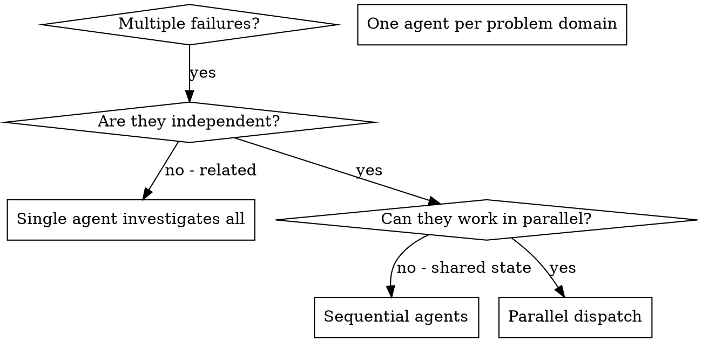

# Dispatching Parallel Agents

## Overview

You delegate tasks to specialized agents with isolated context. By precisely crafting their instructions and context, you ensure they stay focused and succeed at their task. They should never inherit your session's context or history — you construct exactly what they need. This also preserves your own context for coordination work.

Multiple unrelated failures can be investigated in parallel when each investigation has enough context and
does not depend on another's result. Coordination overhead can outweigh the benefit for small tasks.

**Core principle:** Dispatch only independently useful work within controller-owned scope and budgets.

Apply the [shared execution/context contract](../using-engineering-skills/references/agent-execution.md).
The controller owns routing, findings and integration. Workers do not recursively create helpers or reviewers.
Use the platform's actual model/effort schema; record requested and observed settings separately.

## Ownership and evidence before dispatch

- Give each worker the current contract/source revision, task/gate ID, writable scope, runtime and isolated
  scratch, expected evidence, remaining parent budget and deadline. Select a finite concurrency cap within
  current capacity; two or three workers is not a proven optimum.
- Separate sessions do not isolate files. Parallel implementations need disjoint write ownership or separate
  worktrees, with one integration owner. Shared lockfiles, generated output, test databases and Git index/HEAD
  updates also count as shared state. If those boundaries cannot be closed, execute sequentially.
- In a shared checkout, serialize all index/commit operations through the integration owner. In separate
  worktrees, serialize integration and validate the resulting combined revision. Worktree isolation does not
  make conflicting interface changes independent.
- Parallel reviewers receive the same immutable artifact and evidence in fresh contexts. Do not provide writer
  transcripts, self-pass judgments, or another reviewer's findings before their independent first responses.
  Re-review may receive the findings it must verify. Adjudicate with reproducible evidence, not majority vote.
- Specialist reviews cover a named independent risk; they do not replace the whole-change reviewer or the
  ordinary-review-then-red-team sequence. The SDD task/commit loop remains sequential by default.
- Keep the same task/gate budget across retries, model/session changes and owner returns. Child calls use
  the remaining parent budget rather than creating nested retry allowances. Preserve incomplete executions
  and environment failures separately from code findings.

## When to Use



**Use when:**
- 3+ test files failing with different root causes
- Multiple subsystems broken independently
- Each problem can be understood without context from others
- No shared state between investigations

**Don't use when:**
- Failures are related (fix one might fix others)
- Need to understand full system state
- Agents would interfere with each other

## The Pattern

### 1. Identify Independent Domains

Group failures by what's broken:
- File A tests: Tool approval flow
- File B tests: Batch completion behavior
- File C tests: Abort functionality

Each domain is independent - fixing tool approval doesn't affect abort tests.

### 2. Create Focused Agent Tasks

Each agent gets:
- **Specific scope:** One test file or subsystem
- **Clear goal:** Make these tests pass
- **Constraints:** Don't change other code
- **Expected output:** Summary of what you found and fixed
- **Execution contract:** Revision, task/gate ID, write ownership, runtime/scratch and shared budget

### 3. Dispatch in Parallel

If ownership and the concurrency budget permit three independent workers, issue their dispatches without
waiting for one worker's completion before starting the next:

```text
Subagent (general-purpose): "Fix agent-tool-abort.test.ts failures"
Subagent (general-purpose): "Fix batch-completion-behavior.test.ts failures"
Subagent (general-purpose): "Fix tool-approval-race-conditions.test.ts failures"
# All three run concurrently.
```

Dispatch alone does not prove overlap. Use the runtime's actual start/completion state and concurrency limit.

### 4. Review and Integrate

When agents return:
- Read each summary
- Verify fixes don't conflict
- Run the checks required by the combined change and its integration risks
- Integrate all changes

## Agent Prompt Structure

Good agent prompts are:
1. **Focused** - One clear problem domain
2. **Self-contained** - All context needed to understand the problem
3. **Specific about output** - What should the agent return?

```markdown
Fix the 3 failing tests in src/agents/agent-tool-abort.test.ts:

1. "should abort tool with partial output capture" - expects 'interrupted at' in message
2. "should handle mixed completed and aborted tools" - fast tool aborted instead of completed
3. "should properly track pendingToolCount" - expects 3 results but gets 0

These are timing/race condition issues. Your task:

1. Read the test file and understand what each test verifies
2. Identify root cause - timing issues or actual bugs?
3. Fix by:
   - Replacing arbitrary timeouts with event-based waiting
   - Fixing bugs in abort implementation if found
   - Adjusting test expectations if testing changed behavior

Do NOT just increase timeouts - find the real issue.

Return: Summary of what you found and what you fixed.
```

## Common Mistakes

**❌ Too broad:** "Fix all the tests" - agent gets lost
**✅ Specific:** "Fix agent-tool-abort.test.ts" - focused scope

**❌ No context:** "Fix the race condition" - agent doesn't know where
**✅ Context:** Paste the error messages and test names

**❌ No constraints:** Agent might refactor everything
**✅ Constraints:** "Do NOT change production code" or "Fix tests only"

**❌ Vague output:** "Fix it" - you don't know what changed
**✅ Specific:** "Return summary of root cause and changes"

## When NOT to Use

**Related failures:** Fixing one might fix others - investigate together first
**Need full context:** Understanding requires seeing entire system
**Exploratory debugging:** You don't know what's broken yet
**Shared state:** Agents would interfere (editing same files, using same resources)

## Real Example from Session

**Scenario:** 6 test failures across 3 files after major refactoring

**Failures:**
- agent-tool-abort.test.ts: 3 failures (timing issues)
- batch-completion-behavior.test.ts: 2 failures (tools not executing)
- tool-approval-race-conditions.test.ts: 1 failure (execution count = 0)

**Decision:** Independent domains - abort logic separate from batch completion separate from race conditions

**Dispatch:**
```
Agent 1 → Fix agent-tool-abort.test.ts
Agent 2 → Fix batch-completion-behavior.test.ts
Agent 3 → Fix tool-approval-race-conditions.test.ts
```

**Results:**
- Agent 1: Replaced timeouts with event-based waiting
- Agent 2: Fixed event structure bug (threadId in wrong place)
- Agent 3: Added wait for async tool execution to complete

**Integration:** All fixes independent, no conflicts, full suite green

## Verification

After agents return:
1. **Review each summary** - Understand what changed
2. **Check for conflicts** - Did agents edit same code?
3. **Verify integration** - Run the required focused or full checks on the combined revision
4. **Spot check** - Agents can make systematic errors
