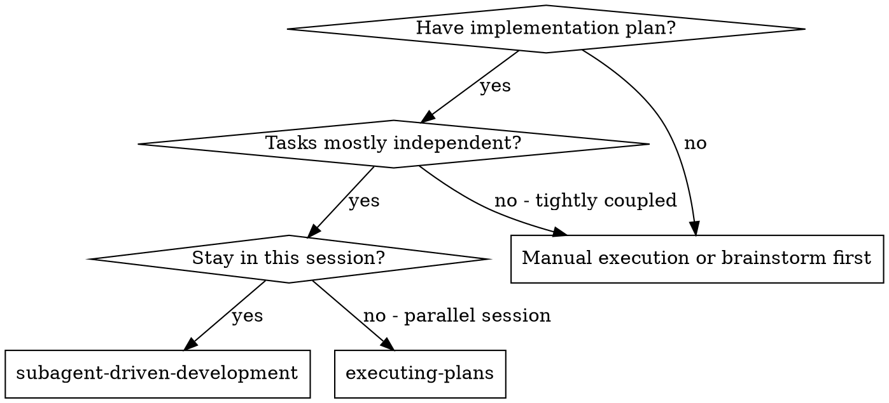

# subagent-driven-development: Subagent 기반 개발

task마다 새로운 implementer subagent를 위임하고, 각 task 뒤에 task 리뷰(spec 준수 + 코드 품질)를 수행하고, 마지막에 전체 브랜치를 폭넓게 리뷰하여 plan을 실행한다.

**Subagent를 사용하는 이유:** 격리된 context를 가진 전문 에이전트에게 task를 위임한다. 지침과 context를 정확히 구성하면 각 에이전트가 task에 집중해 완료할 수 있다. 에이전트가 현재 session의 context나 history를 상속하게 하지 않고 필요한 내용만 직접 구성한다. 이를 통해 자신의 context도 조정 작업에 사용할 수 있게 보존한다.

**핵심 원칙:** task마다 새로운 subagent + task 리뷰(spec + 품질) + 폭넓은 최종 리뷰 = 높은 품질과 빠른 반복

공통 [품질 게이트 계약](../using-engineering-skills/references/quality-gates.md)을 읽고 적용한다.
각 task 리뷰와 최종 전체 브랜치 리뷰는 정확한 하나의 BASE..HEAD 리비전을 대상으로 하는 게이트다.

<HARD-GATE>
이 workflow는 복구와 정확한 review range를 위해 task commit에 의존한다. 현재 대화에서 사용자가 이 plan의 task commit을 명시적으로 승인한 경우에만 시작한다. plan 실행, subagent 사용 또는 자율적인 작업 요청만으로는 commit 권한이 생기지 않는다. task commit이 승인되지 않았다면 `engineering:executing-plans`로 직접 실행하고, commit 결정을 요청하기 전에 최종 diff를 보고한다.
</HARD-GATE>

**진행 설명:** 도구 호출 사이에는 짧은 한 줄만 작성한다. 기록은 ledger와 도구 결과에 남는다.

**연속 실행:** task 사이에 사용자 확인을 받으려고 중단하지 않는다. plan의 모든 task를 멈추지 않고 실행한다. 아래의 다섯 가지 상황 또는 모든 task 완료만 중단 사유다. "Should I continue?" 같은 질문과 진행 요약은 사용자의 시간을 낭비한다. 사용자가 plan 실행을 요청했으므로 실행한다.

**멈추지 말고 판정한다.** 실행 중인 plan은 승인된 spec과 plan 안에서 안전하게 해결할 수 있는
일상적이고 되돌릴 수 있는 모호함 때문에 사람을 기다리지 않는다. spec은 구속력 있는 기준이고
plan은 그 근거이며, 그 범위 안의 세부사항은 자신의 판단으로 결정한다. 모든 결정을 ledger에
`Ruling: <결정> — <이유> — <틀렸을 때의 비용>`으로 기록하고 계속 진행한다. 시도 횟수 상한에
도달한 미해결 필수 게이트를 포함한 아래의 다섯 가지 중단 조건만 예외이며 사용자가 필요하다.

다음 다섯 가지 상황에서만 중단한다. 되돌릴 수 없거나 파괴적인 작업, security-sensitive 작업,
관례상 먼저 확인해야 하는 worktree 밖의 side effect(merge, 공유 브랜치에 push, publish), 어떤
경로를 선택해도 추측이 될 만큼 깨진 plan, 그리고 사람만 위험을 수용할 수 있는 유효한 미해결
finding을 남긴 채 retry 상한에 도달한 필수 품질 게이트다. 이 경우 중단하고 질문한다.

## 사용 시점



**Executing Plans(parallel session)와의 차이:**
- 같은 session을 사용한다(context 전환 없음).
- task마다 새로운 subagent를 사용한다(context 오염 없음).
- 각 task 뒤에 spec 준수와 코드 품질을 리뷰하고 마지막에 폭넓게 리뷰한다.
- task 사이에 사람의 개입이 없어 더 빠르게 반복한다.

## 절차

```dot
digraph process {
    rankdir=TB;

    subgraph cluster_per_task {
        label="Per Task";
        "Dispatch implementer subagent (./implementer-prompt.md)" [shape=box];
        "Implementer asks questions?" [shape=diamond];
        "Answer questions, provide context" [shape=box];
        "Implementer implements, verifies, commits, self-reviews" [shape=box];
        "Generate review package, dispatch task reviewer (./task-reviewer-prompt.md)" [shape=box];
        "Spec ✅ and quality approved?" [shape=diamond];
        "Classify findings by owner before retry" [shape=diamond];
        "Return plan or requirement defect to its owner; stop" [shape=box];
        "Record capability or external-state blocker; stop" [shape=box];
        "Close invalid findings with evidence" [shape=box];
        "Fix round R of 3: R=1 resume; R=2 fresh; R=3 fresh + capability up" [shape=box];
        "Dispatch scoped re-review (./re-review-prompt.md)" [shape=box];
        "All findings addressed?" [shape=diamond];
        "R = 3?" [shape=diamond];
        "Adjudicate residual implementation findings with evidence" [shape=box];
        "All residual findings disproved?" [shape=diamond];
        "Close residual invalid findings with evidence" [shape=box];
        "Record failed + decision_required; stop for human decision" [shape=box];
        "Human accepts risk for exact revision?" [shape=diamond];
        "Record accepted_risk" [shape=box];
        "Return to owning stage with changed input" [shape=box];
        "Append completion to ledger, mark todo complete" [shape=box];
    }

    "Setup: worktree, ledger check, read plan, pre-flight review" [shape=box];
    "More tasks remain?" [shape=diamond];
    "Run final whole-change deterministic verification" [shape=box];
    "Final deterministic verification passed?" [shape=diamond];
    "Return to affected implementation or integration stage" [shape=box];
    "Generate final package, dispatch code reviewer" [shape=box];
    "Final findings? ONE fix, rerun oracle, scoped re-review, adjudicate residuals" [shape=box];
    "Ordinary final gate outcome?" [shape=diamond];
    "Dispatch fresh-context red-team reviewer" [shape=box];
    "Red-team verdict?" [shape=diamond];
    "Preserve workspace through branch decision" [shape=box];
    "Merged result verified?" [shape=diamond];
    "Delete workspace after verified merge" [shape=box];
    "Keep workspace for PR or branch" [shape=doublecircle];
    "Return to owner or stop" [shape=box];
    "Use engineering:finishing-a-development-branch" [shape=box style=filled fillcolor=lightgreen];

    "Setup: worktree, ledger check, read plan, pre-flight review" -> "Dispatch implementer subagent (./implementer-prompt.md)";
    "Dispatch implementer subagent (./implementer-prompt.md)" -> "Implementer asks questions?";
    "Implementer asks questions?" -> "Answer questions, provide context" [label="yes"];
    "Answer questions, provide context" -> "Implementer implements, verifies, commits, self-reviews";
    "Implementer asks questions?" -> "Implementer implements, verifies, commits, self-reviews" [label="no"];
    "Implementer implements, verifies, commits, self-reviews" -> "Generate review package, dispatch task reviewer (./task-reviewer-prompt.md)";
    "Generate review package, dispatch task reviewer (./task-reviewer-prompt.md)" -> "Spec ✅ and quality approved?";
    "Spec ✅ and quality approved?" -> "Append completion to ledger, mark todo complete" [label="yes"];
    "Spec ✅ and quality approved?" -> "Classify findings by owner before retry" [label="no"];
    "Classify findings by owner before retry" -> "Return plan or requirement defect to its owner; stop" [label="plan / requirement"];
    "Classify findings by owner before retry" -> "Record capability or external-state blocker; stop" [label="blocked"];
    "Classify findings by owner before retry" -> "Close invalid findings with evidence" [label="invalid / out of scope"];
    "Close invalid findings with evidence" -> "All findings addressed?";
    "Classify findings by owner before retry" -> "R = 3?" [label="valid implementation"];
    "Fix round R of 3: R=1 resume; R=2 fresh; R=3 fresh + capability up" -> "Dispatch scoped re-review (./re-review-prompt.md)";
    "Dispatch scoped re-review (./re-review-prompt.md)" -> "All findings addressed?";
    "All findings addressed?" -> "Append completion to ledger, mark todo complete" [label="yes"];
    "All findings addressed?" -> "Classify findings by owner before retry" [label="no"];
    "R = 3?" -> "Fix round R of 3: R=1 resume; R=2 fresh; R=3 fresh + capability up" [label="no - next round"];
    "R = 3?" -> "Adjudicate residual implementation findings with evidence" [label="yes - breaker trips"];
    "Adjudicate residual implementation findings with evidence" -> "All residual findings disproved?";
    "All residual findings disproved?" -> "Close residual invalid findings with evidence" [label="yes"];
    "Close residual invalid findings with evidence" -> "Append completion to ledger, mark todo complete";
    "All residual findings disproved?" -> "Record failed + decision_required; stop for human decision" [label="no"];
    "Record failed + decision_required; stop for human decision" -> "Human accepts risk for exact revision?";
    "Human accepts risk for exact revision?" -> "Record accepted_risk" [label="yes"];
    "Record accepted_risk" -> "Append completion to ledger, mark todo complete";
    "Human accepts risk for exact revision?" -> "Return to owning stage with changed input" [label="no"];
    "Append completion to ledger, mark todo complete" -> "More tasks remain?";
    "More tasks remain?" -> "Dispatch implementer subagent (./implementer-prompt.md)" [label="yes"];
    "More tasks remain?" -> "Run final whole-change deterministic verification" [label="no"];
    "Run final whole-change deterministic verification" -> "Final deterministic verification passed?";
    "Final deterministic verification passed?" -> "Return to affected implementation or integration stage" [label="no"];
    "Final deterministic verification passed?" -> "Generate final package, dispatch code reviewer" [label="yes"];
    "Generate final package, dispatch code reviewer" -> "Final findings? ONE fix, rerun oracle, scoped re-review, adjudicate residuals";
    "Final findings? ONE fix, rerun oracle, scoped re-review, adjudicate residuals" -> "Ordinary final gate outcome?";
    "Ordinary final gate outcome?" -> "Dispatch fresh-context red-team reviewer" [label="passed / accepted_risk"];
    "Ordinary final gate outcome?" -> "Return to owner or stop" [label="non-advancing status"];
    "Dispatch fresh-context red-team reviewer" -> "Red-team verdict?";
    "Red-team verdict?" -> "Preserve workspace through branch decision" [label="survives_challenge"];
    "Red-team verdict?" -> "Preserve workspace through branch decision" [label="human accepts exact risk"];
    "Red-team verdict?" -> "Return to owner or stop" [label="invalidated / inconclusive / blocked"];
    "Preserve workspace through branch decision" -> "Use engineering:finishing-a-development-branch";
    "Use engineering:finishing-a-development-branch" -> "Merged result verified?";
    "Merged result verified?" -> "Delete workspace after verified merge" [label="yes"];
    "Merged result verified?" -> "Keep workspace for PR or branch" [label="PR / keep / failed"];
}
```



## 설정

작업이 격리된 workspace에서 수행되도록 `engineering:using-git-worktrees`로 만들거나 기존
workspace를 확인한다. 사용자의 명시적인 동의 없이 main/master 브랜치에서 구현을 시작하지 않는다.

ledger를 만들거나 Task 1을 위임하기 전에 task commit을 승인한 정확한 사용자 메시지를 기록한다. plan header에서 commit이 승인됐다고 하더라도 대화에 승인 내용이 없으면 plan은 오래된 것이며 권한을 부여하지 않는다. 위임 전에 중단한다.

대화 memory는 compaction 뒤에도 유지되지 않는다. 실제 session에서 현재 위치를 잃은 controller가
이미 완료한 전체 task sequence를 다시 위임한 사례가 있으며, 관찰된 실패 중 비용이 가장 컸다.
진행 상태를 todo뿐 아니라 ledger 파일에도 추적한다.

- 각 plan은 자체 workspace를 소유한다. 스킬 시작 시 이 스킬의 `scripts/sdd-workspace PLAN_FILE`을
  실행한다. 이 명령은 plan의 git-ignored 디렉터리(`<repo-root>/.engineering/sdd/<plan-basename>/`)를
  출력하며, 현재 plan의 모든 artifact인 ledger, brief, report와 review package를 이곳에 둔다.
  다른 plan의 디렉터리는 읽거나 쓰지 않는다.
- `<workspace>/progress.md`에서 현재 plan의 ledger를 확인한다. 첫 줄에 현재 plan 파일이 적혀
  있으면 task별 `Task <N>: complete`와 `Task <N>: reopened` 항목 가운데 가장 나중 상태를
  기준으로 판단한다. 최신 상태가 `complete`인 task만 DONE이다. 이후의 `reopened`는 이전
  완료·검증·리뷰를 무효화하므로 가장 이른 reopened 또는 미완료 task부터 재개한다. 마지막 줄이
  수정 회차인 task는 loop 진행 중이므로 다음 회차부터 재개한다.
  첫 줄에 다른 plan 파일이 적힌 ledger는 다른 plan의 진행 상태다. 그대로 두고 현재 plan용
  ledger를 새로 만든다.
- 첫 줄에 `# SDD ledger — plan: <plan file path>` 식별자를 넣어 ledger를 만든다.
- ledger는 복구 map이다. 자신의 context가 생성 사실을 기억하지 못해도 ledger에 적힌 commit은
  git에 존재한다. compaction 뒤에는 기억보다 ledger와 `git log`를 신뢰한다.
- `git clean -fdx`는 git-ignored scratch인 workspace를 삭제한다. 그런 일이 발생하면 `git log`에서 복구한다.

plan을 한 번 읽고 context와 Global Constraints를 기록한 뒤 task마다 todo를 만든다. plan에서
Spec을 지정하면 함께 읽는다. spec은 plan이 근거로 삼는 기준이며 plan 내부 충돌은 spec을
기준으로 해결한다. 접근 가능한 spec이 없으면 ledger에 그 사실을 기록하고, spec 없이 내린
판정은 잠정적인 것으로 취급한다.

별도 구현 plan이 필요한 작업에는 `engineering:writing-plans`가 정의한 의사코드와 flow mapping이
있어야 한다. 각 task가 참조하는 flow ID, 파일·책임, dependency와 검증 방법·이유를 pre-flight에서
확인하고, 이 연결이 없으면 implementer에게 빈틈을 넘기지 말고 plan 소유 단계로 돌려보낸다.

Task 1을 위임하기 전에 plan의 충돌을 한 번 검사하고 확인한 내용을 그때그때 기록한다.

- 서로 충돌하거나 plan의 Global Constraints와 충돌하는 task
- 의사코드 flow와 파일, task, dependency 또는 검증 mapping이 불일치하는 task
- plan에서 명시적으로 요구하지만 review rubric에서는 결함으로 보는 내용(아무것도 assert하지 않는 테스트, logic block의 verbatim duplication)

검사 결과는 판정이 아니라 표다. 파일 또는 interface를 공유하는 모든 task 쌍마다 한 행을 만들고,
두 task, 한쪽이 생산하는 내용과 다른 쪽이 소비하는 내용, 발견한 내용을 적는다. 모든 task마다
한 행을 만들어 task 본문이 내부적으로 일치하는지 확인한다. 지정된 테스트와 코드, 생성할 파일과
나중에 수정할 파일을 대조한다. 이런 행 없이 "The scan is clean"이라고만 쓰면 실행한 검사가 아니다.

표를 ledger에 작성한다. 실행을 시작하기 전에 발견한 모든 항목을 해당 내용을 요구한 plan
본문과 대조해 판정하고 각 판정을 ledger에 기록한다. 검사 결과가 clean이면 별도 언급 없이
진행한다. 발견된 각 충돌을 판정하고(spec은 구속력 있는 기준, plan은 그 근거다) 행 옆에 판정을
기록한 뒤 Task 1을 위임한다. 구현 과정에서만 드러나는 충돌은 review loop가 계속 잡아낸다.

## 모델 선택

비용을 줄이고 속도를 높이도록 각 역할을 처리할 수 있는 가장 가벼운 모델을 사용한다.

**기계적인 구현 task**(격리된 함수, 명확한 spec, 1-2개 파일): 빠르고 저렴한 모델을 사용한다. plan이 명확하면 대부분의 구현 task는 기계적이다.

**통합과 판단 task**(여러 파일 조정, pattern matching, debugging): 표준 모델을 사용한다.

**Architecture와 설계 task:** 사용 가능한 가장 성능이 높은 모델을 사용한다. 최종 전체 브랜치
리뷰와 red-team 리뷰도 여기에 해당한다. session 기본값이 아니라 역할에 맞는 모델과 추론도를
명시해 위임한다.

**리뷰 task:** 같은 판단을 내릴 수 있는 모델 중 diff의 크기, 복잡성과 위험에 맞는 모델을
선택한다. 작고 기계적인 diff에는 가장 성능이 높은 모델이 필요 없지만 미묘한 concurrency
변경에는 필요하다. 작은 수정 diff의 범위가 제한된 재리뷰에는 저가에서 중간 tier를 사용한다.

**Fix-loop 상향(2-3회차):** 새 context에 이전 시도와 열린 finding만 전달하고, 판단 부족이
원인이면 막힌 implementer보다 적어도 한 tier 높은 모델 또는 추론도를 사용한다.

**subagent를 위임할 때 실제 schema가 두 override를 모두 지원하면 모델과 추론도를 함께
명시한다.** 한쪽만 override하지 않는다. 지원하지 않으면 확인 가능한 role·preset·machine
default를 사용하고 fallback을 기록한다. 구체적인 Codex 조합과 fallback은
[Codex 도구 참고](../using-engineering-skills/references/codex-tools.md)를 따른다.

**Turn 수가 token 가격보다 중요하다.** 실제 시간과 context 비용은 subagent가 사용하는 turn
수에 비례하며, 가장 저렴한 모델은 여러 단계의 작업에서 흔히 2-3배 많은 turn을 사용해 전체
비용이 더 커진다. reviewer와 산문 설명을 바탕으로 작업하는 implementer에는 적어도 중간 tier
모델을 사용한다. task의 plan 본문에 작성할 전체 코드가 있다면 구현은 옮겨 적고 테스트하는
작업이므로 가장 저렴한 tier를 사용한다. 한 파일의 기계적인 수정에도 가장 저렴한 tier를 사용한다.

**Task 복잡성 신호(구현 task):**
- 완전한 spec으로 1-2개 파일 수정 → 저렴한 모델
- 통합 문제를 포함해 여러 파일 수정 → 표준 모델
- 설계 판단 또는 넓은 codebase 이해 필요 → 가장 성능이 높은 모델

## Task loop(작업 반복)

**형태가 같은 작은 작업은 batch로 묶는다.** plan에 여러 task가 있고 각 task가 여러 파일에
반복되는 같은 한 줄 수정, constant 변경 또는 field 추가처럼 작고 독립적인 같은 종류의
수정이라면 task마다 subagent를 하나씩 위임하지 않는다. 모든 파일과 변경을 나열한 하나의
dispatch brief를 만들어 전체 batch를 한 subagent에게 보내고 diff를 하나의 단위로 리뷰한다.
별도의 판단, 테스트 또는 리뷰 surface가 필요한 작업에만 task별 위임을 사용한다.

dispatch prompt에 붙여 넣은 모든 내용과 subagent가 출력한 모든 내용은 session이 끝날 때까지
context에 남아 이후 turn마다 다시 읽힌다. artifact는 파일로 전달한다.

**위임한 subagent 기다리기:** 짧은 timeout으로 wait interface를 polling하지 않고, 조용히 끝없이
한 번만 기다리지도 않는다. ledger 갱신, 다음 review package 생성, report 읽기처럼 로컬 작업이
남아 있으면 계속 작업한다. child 결과는 자동으로 도착한다. 실제로 할 일이 없을 때에는 플랫폼이
허용하는 범위에서 5-10분의 제한된 구간 동안 기다린다. 구간 사이에 상태를 한 줄로 알리고 live
child 목록을 확인해 보고 없이 완료한 child를 찾는다. 제한된 대기는 긴 대기의 효율을 거의
유지하면서도 막히거나 사라진 child를 session 끝이 아니라 몇 분 안에 발견하게 한다.

### 1. Implementer 위임

위임하기 전에 BASE(`git rev-parse HEAD`)를 기록한다. review package와 수정 회차 diff에 필요하다.

- **Task brief:** implementer를 위임하기 전에 이 스킬의 `scripts/task-brief PLAN_FILE N`을
  실행한다. 첫 Task 앞의 plan header·전역 제약·`Behavioral Flow Pseudocode`·flow mapping과
  선택한 task 전체 본문을 고유한 이름의 파일로 추출하고 경로를 출력한다. 다른 task 본문은
  제외한다. brief가 요구사항과 해당 task에 적용되는 흐름의 단일 출처가 되도록 dispatch를
  구성한다. dispatch에는 다음을 포함한다. (1) project에서 이 task가 위치하는 곳을 설명하는 한 줄,
  (2) "먼저 읽을 요구사항이며 정확한 값을 그대로 사용한다"고 소개한 brief 경로, (3) brief에서
  알 수 없는 이전 task의 interface·결정, (4) brief에서 발견한 모호함에 대한 판정, (5) report 파일
  경로와 report 계약. 정확한 값(숫자, magic string, signature, test case)은 brief에만 둔다.
  subagent에게 전체 plan 파일을 읽게 하지 않는다.
- **Report 파일:** brief 이름을 기준으로 implementer의 report 파일을 정하고(brief
  `…/task-N-brief.md` → report `…/task-N-report.md`) dispatch prompt에 넣는다. implementer는
  전체 report를 이 파일에 작성하고 상태, commit, 한 줄 검증 요약과 우려 사항만 반환한다.
- dispatch prompt는 session history가 아니라 하나의 task를 설명한다. 누적된 이전 task 요약
  ("state after Tasks 1-3")을 이후 dispatch에 붙여 넣지 않는다. 실제 session의 dispatch가
  42k자에 도달했고 그중 99%가 붙여 넣은 history였던 사례가 있다. 새 subagent에는 task, 건드리는
  interface와 전역 제약만 필요하다.
- dispatch에는 subagent 금지 계약이 들어 있다(implementer template에 포함됨). implementer는
  helper와 reviewer를 포함해 subagent를 위임하지 않는다. 리뷰는 report 이후 controller가
  위임한다. 실제 session에서 worker가 생성한 모든 reviewer는 controller가 위임한 task 리뷰와
  중복되어 task마다 전체 리뷰 자리 하나를 추가로 사용했다.
- 이전 task에 현재 task가 건드리는 영역의 accepted-risk 또는 근거로 닫은 finding이 있으면
  dispatch에 해당 ledger 항목의 pointer를 포함한다.
- dispatch 결과에서 implementer의 agent identity를 기록한다. fix-loop 1회차까지만 이 에이전트를
  재개하며, 2-3회차에는 이전 session history를 상속하지 않는 새 implementer를 위임한다.
- 충돌을 막기 위해 여러 구현 subagent를 병렬로 위임하지 않는다.

템플릿: [implementer-prompt.md](implementer-prompt.md)

### 2. Report 처리

Implementer subagent는 네 가지 상태 중 하나를 보고한다. 각 상태를 다음과 같이 처리한다.

**DONE:** 이 스킬 디렉터리에서 `scripts/review-package PLAN_FILE BASE HEAD`로 review package를
생성한다. 명령은 작성한 고유 파일 경로를 출력한다. BASE는 implementer를 위임하기 전에 기록한
commit이며, 여러 commit으로 구성된 task에서 마지막 commit 이외를 조용히 누락하는 `HEAD~1`을
사용하지 않는다. 출력된 경로와 함께 task reviewer를 위임한다.

**DONE_WITH_CONCERNS:** implementer가 작업을 완료했지만 의문을 표시했다. 진행하기 전에 우려
사항을 읽는다. 정확성 또는 범위에 관한 내용이라면 리뷰 전에 처리한다. 관찰(예: "this file is
getting large")이라면 기록하고 리뷰로 진행한다.

**NEEDS_CONTEXT:** implementer에게 제공되지 않은 정보가 필요하다. 빠진 context를 제공하고 다시 위임한다.

**BLOCKED:** implementer가 task를 완료할 수 없다. blocker를 평가한다.
1. context 문제라면 context를 추가하고 같은 모델로 다시 위임한다.
2. task에 더 많은 reasoning이 필요하면 더 성능이 높은 모델로 다시 위임한다.
3. task가 너무 크다면 더 작은 단위로 나눈다.
4. plan 자체가 틀렸거나 구현에 material deviation이 필요하다면 차이와 이유를 기록하고 중단한다.
   승인된 요구사항·설계·관찰 가능한 계약을 바꾸는 차이는 `engineering:brainstorming`으로 돌아가
   변경안을 제시하고 사용자의 명시적인 재승인을 기다린다. 승인된 설계 안의 차이이거나 재승인을
   받은 뒤 `engineering:writing-plans`에서 의사코드를 먼저 갱신하고 영향을 받는 mapping, task와
   검증을 조정한다. 영향받은 완료 task마다
   `Task <N>: reopened (plan <old> -> <new>; <reason>)`를 ledger에 추가하여 이전 게이트를
   무효화한다. 변경된 plan-readiness gate가 통과하면 가장 이른 reopened 또는 미완료 task를 새
   brief로 다시 위임한다.

상위 보고를 **절대** 무시하거나 같은 모델에 변경 없이 재시도하도록 강제하지 않는다. implementer가 막혔다고 했다면 무엇인가 달라져야 한다.

implementer가 시작 전 또는 task 도중 질문하면 명확하고 완전하게 답하고, 필요하면 context를
추가하며, 성급하게 구현으로 밀어 넣지 않는다.

### 3. Task 리뷰

task별 리뷰는 task 범위의 게이트다. 폭넓은 리뷰는 최종 전체 브랜치 리뷰에서 한 번 수행한다.
task 리뷰를 생략하거나 두 판정 중 하나가 빠진 report를 받아들이지 않는다. spec 준수와 task
품질이 모두 필요하다. implementer의 자체 리뷰가 task 리뷰를 대신하지 않으며 둘 다 필요하다.

위임 전에 게이트의 task artifact, BASE..HEAD 리비전, 필수 판정, 통과 조건, task 구현 반환 대상,
시도 횟수 상한과 decision owner를 기록한다. 필수 판정이 빠졌다면 clean이 아니라 `inconclusive`다.

- reviewer에게 diff를 파일로 전달한다. 이 스킬의 `scripts/review-package PLAN_FILE BASE HEAD`를
  실행하고 출력된 파일 경로를 전달한다. bash가 없다면 해당 range의 `git log --oneline`,
  `git diff --stat`, `git diff -U10`을 고유한 이름의 한 파일로 redirect한다. 출력은 자신의
  context에 들어가지 않고 reviewer는 한 번의 Read 호출로 commit 목록, stat 요약과 context가
  포함된 전체 diff를 본다. implementer를 위임하기 전에 기록한 BASE를 사용하며 여러 commit의
  task를 조용히 잘라내는 `HEAD~1`을 사용하지 않는다. diff 파일 없이 task reviewer를 위임하지 않는다.
- **Reviewer 입력:** task reviewer는 같은 brief 파일, report 파일, review package의 세 경로와
  task에 적용되는 전역 제약을 받는다.
- reviewer에게 전달하는 global-constraints block은 주의할 내용을 정하는 lens다. plan의 Global
  Constraints 섹션 또는 spec에서 구속력 있는 요구사항을 그대로 복사한다. 정확한 값, 형식과
  component 사이의 명시된 관계("same layout as X", "matches Y")를 포함한다. reviewer
  template에는 process 규칙(YAGNI, test hygiene, review 방법)이 이미 있으므로 constraints
  block에는 현재 project의 spec이 요구하는 내용을 넣는다.
- 구체적이고 task에 한정된 이유 없이 "check all uses" 또는 "run race tests if useful" 같은 열린 지침을 추가하지 않는다.
- implementer가 같은 작업에서 이미 실행한 검증을 reviewer에게 반복하라고 하지 않는다. implementer report가 근거를 전달한다.
- reviewer의 finding을 미리 판정하지 않는다. 특정 문제를 무시하거나 보고하지 말라고 지시하지
  않는다. finding이 false positive라고 생각하더라도 reviewer가 제기하게 한 뒤 review loop에서
  판정한다. 작성 중인 prompt에 "do not flag", "don't treat X as a defect", "at most Minor" 또는
  "the plan chose"가 있다면 중단한다. review loop를 피하려고 미리 판정하고 있을 가능성이 크다.
task reviewer는 변경되지 않은 코드에 있거나 여러 task에 걸쳐 있는 요구사항을 "⚠️ Cannot verify
from diff" 항목으로 보고할 수 있다. 이 항목은 나머지 리뷰를 막지 않지만 task를 완료로 표시하기
전에 각 항목을 직접 해결해야 한다. reviewer에게 없는 plan과 task 간 context를 가지고 있기
때문이다. 실제 공백으로 확인되면 실패한 spec 리뷰로 취급해 다른 finding과 함께 fix loop에 넣는다.

템플릿: [task-reviewer-prompt.md](task-reviewer-prompt.md)

### 4. Fix loop(수정 반복)

각 리뷰 또는 재리뷰 직후 모든 finding을 소유 단계에 따라 분류한다.

- 명백히 유효하지 않거나 범위 밖인 finding은 근거와 함께 닫는다. 이로써 모든 필수 finding이 해결되면 task를 완료할 수 있다.
- task 세부사항 또는 interface 결함은 `engineering:writing-plans`로 돌려보낸다.
- 승인된 요구사항 또는 설계의 모순은 `engineering:brainstorming`으로 돌려보낸다.
- 빠진 capability, 권한, service, dependency 또는 외부 상태는 재개에 필요한 조건과 함께 `blocked`로 기록한다.
- 유효한 구현 finding만 범위가 제한된 fix loop에 넣는다.

이 소유 단계 분류는 routing이며 상한 도달 시의 판정이 아니다. 실패한 입력을 바꿀 수 없는 코드
재시도를 막는다. loop는 유효한 구현 finding, 즉 spec ❌, Critical 또는 Important 문제,
구현 공백으로 확인한 ⚠️ 항목에만 시작한다.

Minor finding은 loop 전에 제외한다. 진행하면서 progress ledger에 `Task <N>: minor (deferred):
<one-liner>`로 기록하고 최종 전체 브랜치 리뷰가 이 목록을 보고 merge 전에 수정할 항목을
분류하게 한다. 아무도 읽지 않는 요약은 조용한 폐기다. Minor finding은 loop에 들어가지 않고
남은 유효한 구현 finding만 들어간다. 수정 회차는 한 번의 수정 위임과 범위가 제한된 재리뷰로
구성하며 task마다 최대 3회다.

**1회차 — 원래 implementer를 재개한다.** 열린 finding을 그대로 전달한다. context가 남아
있으므로 task, 코드와 자신의 선택을 알고 있다. harness에서 실행 중인 subagent에게 추가
메시지를 보낼 수 없다면 brief 경로, report 파일 경로와 finding을 포함해 새 implementer를
위임한다. 어느 경우든 report 파일이 영속 memory다.

**2회차 — fresh-context implementer를 위임한다.** 이전 agent의 session history나 결론을
상속하지 않는다. brief 경로, report 파일 경로, 현재 열린 finding, 현재 리비전과 이전 시도
횟수만 전달한다.

**3회차 — 또 다른 fresh context와 상위 capability를 사용한다.** 2회차 agent를 재사용하지 않고
해당 task에 적합한 한 단계 높은 허용 모델을 우선 사용해 마지막 수정을 위임한다. 상위 모델을
사용할 수 없으면 가장 가까운 허용 조합과 reasoning effort fallback을 기록한다. 새 관점이 필요한
시점에 기존 context를 계속 재사용해 같은 오류를 강화하지 않는다.

**모든 회차:** implementer는 문제를 수정하고, 변경된 작업을 다루는 집중 검증을 다시 실행하고,
같은 report 파일에 수정 보고를 추가하고, 짧은 계약을 반환한다. reviewer를 다시 위임하기 전에
수정 report에 해당 검사, 실행한 명령과 출력이 모두 있는지 확인한다. 세 가지가 모두 있으면
재리뷰를 위임한다. 코드 동작은 수정 메시지에 관련 테스트 파일을 적고, 문서, metadata와 단순
configuration 수정에는 변경에 비례한 검사를 사용한다.

**재리뷰의 범위는 제한된다.** 이전 리뷰에서 확인한 head를 FIX_BASE로 사용하여
`scripts/review-package PLAN_FILE FIX_BASE HEAD`를 실행한다. finding 목록, brief, report 파일과
출력된 diff 경로를 [re-review-prompt.md](re-review-prompt.md)에 넣어 위임한다. 재리뷰어는 각
finding을 ADDRESSED 또는 NOT ADDRESSED로 판정하고 수정 diff의 새 문제만 표시한다. 수정 diff의
새 Critical/Important 문제는 열린 finding 목록에 추가한다. 범위 밖 관찰은 deferred minor로
ledger에 기록하며 loop를 확장하지 않는다.

**각 회차 뒤** ledger에 다음을 추가한다.
`Task <N>: fix round <R>/3 (<X> addressed, <Y> open — <finding one-liners>; commits <a7>..<b7>)`

재시도할 때마다 구현, 근거, 관련 context, evaluator 또는 사용 가능한 capability가 달라져야
한다. 변경 없는 결정론적 검사를 반복하거나 같은 reviewer에게 같은 package로 다시 시도하라고
하지 않는다.

controller session에서 finding을 직접 수정하지 않는다. context를 조정 작업에 사용할 수 있게
유지하고 controller의 수정으로 리뷰를 건너뛰지 않는다.

**차단기.** 3회차 재리뷰 뒤에도 구현 finding이 열려 있으면 위임을 중단한다. 가지고 있는 plan,
코드와 검증 근거로 남은 각 finding을 판정한다.

- **명백히 유효하지 않거나 이 게이트의 선언된 범위 밖:** ledger에 근거와 함께 닫는다.
  `Task <N>: finding closed — <finding> — Ruling: <반증하거나 제외하는 근거>`. 단순히 논쟁의
  여지가 있다는 것으로는 부족하다.
- **유효한 task 구현 finding:** 게이트를 `failed`, `decision_required`로 기록하고 task 구현을
  반환 대상으로 지정한 뒤, 변경된 전략 또는 `accepted_risk`에 대한 사람의 결정을 기다리며 중단한다.

지명된 사람인 의사결정자만 유효한 미해결 finding을 수용할 수 있다. 정확한 리비전에 대해
명시적으로 수용하면 `accepted_risk`, finding, 결과, 범위와 결정 근거를 기록한다. 상한 도달,
결함이 핵심이 아니라는 판단 또는 controller 판정 기록으로 실제 finding이 `passed`가 되지는 않는다.

남은 구현 finding의 판정만 상한까지 기다린다. 소유 단계 routing은 모든 리뷰 뒤, 재시도 전에
수행한다. 모든 routing 결정과 상한 판정은 ledger 항목이며 조용한 폐기는 금지한다.

### 5. Task 완료

리뷰가 clean이거나, 남은 모든 finding을 근거로 반증했거나, 사람이 정확한 리비전의 남은 위험을
명시적으로 수용하면 다른 bookkeeping과 같은 메시지에서 ledger에 완료 줄을 추가한다.

- `Task <N>: complete (commits <base7>..<head7>, review clean)`
- `Task <N>: complete (commits <base7>..<head7>, accepted_risk: <decision evidence>)`
- `Task <N>: reopened (plan <old> -> <new>; <reason>)`

task별 가장 나중 상태만 현재 상태다. `reopened` 뒤 새 리비전의 구현·검증·리뷰가 끝나 다시
`complete`를 기록하기 전에는 DONE으로 취급하지 않는다. 완료 시 todo를 완료로 표시하고 다음으로
넘어간다. 해당 리비전에 대해 사람의 명시적인 `accepted_risk` 없이 리뷰에 유효한
Critical/Important 문제가 열려 있다면 다음 task로 이동하지 않는다.

## 최종 리뷰

최종 전체 브랜치 리뷰는 또 다른 단계별 소유 게이트다. 먼저 전체 브랜치에서 plan이 요구하는
최종 결정론적 검증을 실행하고 명령, 출력과 정확한 HEAD를 기록한다. 실패하면 `failed`를
기록하고 영향을 받은 구현 또는 통합 단계로 돌아간다. 아직 추론 기반 reviewer를 위임하지 않는다.

결정론적 검사가 통과하면 게이트의 artifact, MERGE_BASE..HEAD 리비전, 필수 판정, 근거, finding,
반환 대상, 시도 횟수와 decision owner를 기록한다. `scripts/review-package PLAN_FILE MERGE_BASE HEAD`
(MERGE_BASE는 브랜치가 시작된 commit, 예: `git merge-base main HEAD`)를 실행하고 최종 리뷰
dispatch에 출력된 경로와 SHA-256 리비전을 포함한다. 그러면 최종 reviewer가 git 명령으로
브랜치 diff를 다시 만들지 않고 한 파일만 읽는다. Model Selection에 따라 사용 가능한 가장
성능이 높은 모델로 위임하며, `engineering:requesting-code-review`의
[code-reviewer.md](../requesting-code-review/code-reviewer.md)를 사용한다. merge 전에 수정할
항목을 분류할 수 있도록 ledger의 deferred-minor, 근거로 닫은 finding과 accepted-risk 줄을 가리킨다.

최종 전체 브랜치 리뷰에서 finding이 나오면 finding마다 fixer를 하나씩 두지 말고 전체 finding
목록을 하나의 수정 subagent에게 위임한다. finding별 fixer는 각각 context를 다시 만들고 suite를
다시 실행한다. 실제 session에서 최종 리뷰의 수정 wave가 모든 task의 합보다 비용이 많이 든
사례가 있다. 새 HEAD에서 영향을 받은 검사와 필수 전체 변경 결정론적 검사를 다시 실행한다.
통과한 뒤에만 수정 wave의 범위가 제한된 재리뷰를 정확히 한 번 실행한다(수정 range에
`scripts/review-package PLAN_FILE FIX_BASE HEAD`, [re-review-prompt.md](re-review-prompt.md)).
남은 finding은 task loop의 차단기처럼 분류한다. 명백히 유효하지 않은 finding은 근거와 함께
닫을 수 있다. 유효한 미해결 필수 finding은 `failed`와 `decision_required`를 기록하고 사람의
결정을 기다리며 중단한다. 통과한 최종 리뷰로 보류할 수 없다. plan, 전략, evaluator, capability
변경 또는 사람의 명시적인 `accepted_risk` 없이 두 번째 수정 wave를 실행하지 않는다.

일반 최종 리뷰가 `passed`이거나 정확한 리비전에 대해 사람이 `accepted_risk`를 기록했더라도,
plan-backed 작업은 별도의 red-team completion gate를 반드시 거친다. 이 게이트는 일반 리뷰를
강화하는 재리뷰가 아니라 지금까지 선택한 문제 정의, 요구사항, 설계, plan, 구현과 검증이 실제
목표를 해결하는지를 반증하려는 단계다.

1. red-team을 위임하기 직전에 `scripts/review-package PLAN_FILE MERGE_BASE HEAD`를 다시 실행하여
   현재 전체 변경의 새 immutable review package와 digest를 고정한다. 일반 최종 리뷰에서 수정이
   없었더라도 이 단계의 정확한 HEAD를 기록하며, `FIX_BASE..HEAD` 수정 package나 이전 HEAD의 전체
   package를 대신 사용하지 않는다. 여기에 원래 목표, 승인된 요구사항·설계, plan의 의사코드·
   mapping, 결정론적 검증 report와 관찰된 결과의 읽기 전용 경로를 더한다. 일반 review finding이
   artifact 변경을 유도했다면 verdict·칭찬 없이 finding 원문·근거에서 적용 revision·path로 이어지는
   중립적인 provenance를 더하고, 그렇지 않으면 `none`을 기록한다.
2. 이전 implementer, reviewer의 session history, 결론 또는 칭찬을 전달하지 않고 fresh-context
   reviewer를 위임한다. [red-team-reviewer.md](../requesting-code-review/red-team-reviewer.md)를
   사용하고 Codex에서는 역할별 matrix의 가장 강한 red-team 조합을 명시한다.
3. reviewer는 finding 수를 채우지 않으며 가장 강한 반례를 근거로 검증한다. 판정은 정확히
   `survives_challenge`, `invalidated`, `inconclusive`, `blocked` 중 하나다.
4. `survives_challenge`만 red-team의 일반 통과다. `invalidated`는 finding 소유 단계로 돌아가며
   요구사항·설계가 바뀌면 brainstorming 재승인, plan이 바뀌면 writing-plans 갱신과 영향 task
   `reopened`, 구현이면 해당 task 재개, 검증이면 verification 단계 재실행으로 routing한다.
   `inconclusive` 또는 `blocked`는 통과가 아니며 부족한 근거나 capability의 소유 단계로 돌린다.
5. 수정 후 새 리비전을 다시 challenge할 때에는 반드시 또 다른 fresh-context reviewer를 사용한다.
   같은 artifact와 같은 evaluator의 무변경 재시도는 금지하며 red-team 자동 시도도 최대 3회다.
   상한 뒤 유효한 위험이 남으면 `decision_required`로 중단하고, 사람이 정확한 리비전과 위험을
   명시적으로 수용한 경우에만 `accepted_risk`로 다음 단계에 갈 수 있다.

## 마무리

무엇이든 삭제하기 전에 `Ruling:`이 포함된 모든 ledger 줄(preflight 판정과 근거 기반 finding
분류)과 모든 `accepted_risk` 줄을 내린 순서대로 final message의 "Rulings I made" 아래에 모은다.
각 항목에는 틀렸을 때의 비용을 적는다. 이 목록은 빠짐없어야 한다. ledger에 판정 또는 수용한
위험이 있다면 목록에도 있어야 한다. 결정과 남은 위험을 사용자에게 전달하는 유일한 장소다.
workspace와 함께 사라지는 기록은 몰래 내린 결정이다.

일반 최종 브랜치 게이트가 `passed` 또는 정확한 리비전의 `accepted_risk`이고 red-team도
`survives_challenge` 또는 사람의 정확한 위험 수용으로 진행할 수 있으면 workspace를 보존한 채
`engineering:finishing-a-development-branch`를 사용한다. PR 생성 또는 브랜치 보존을 선택하면
후속 피드백을 위해 workspace를 유지한다. local merge를 선택해 merge 결과 검증까지 통과한 뒤에만
현재 plan의 workspace를 삭제한다. worktree 정리가 workspace를 함께 제거하면 별도로
`rm -rf`하지 않는다. sibling 디렉터리는 다른 plan 소유이므로 그대로 둔다. 어느 최종 게이트든
`accepted_risk`였다면 삭제 전 final message에 보존한 근거와 결정 기록이 있는지 확인한다.

## 자주 하는 합리화

| 변명 | 실제 |
|--------|---------|
| "Close enough on spec compliance" | reviewer가 spec 공백을 발견했다면 완료가 아니다. 수정하거나 상한에서 근거로 반증하거나 사람의 명시적인 `accepted_risk`를 받아야 한다. |
| "I'll fix it myself, dispatching is overhead" | controller의 수정은 context를 오염시키고 리뷰를 건너뛴다. implementer를 재개한다. |
| "One more round will converge" | 상한을 넘으면 자동 회차를 중단한다. 실제 게이트 상태를 기록하고 결정을 routing한다. |
| "The reviewer will just find something new anyway" | 범위가 제한된 재리뷰는 수정 내용을 검증하며 범위를 벗어날 수 없다. 건드리지 않은 코드의 새 finding은 loop가 아니라 ledger로 보낸다. |
| "This finding is obviously wrong, I'll drop it" | 상한에서만 판정하고 근거가 있을 때에만 닫으며 모든 판정을 기록한다. 조용한 폐기는 금지한다. |
| "The fix was small, skip the re-review" | 리뷰하지 않은 수정으로 회귀가 반영된다. 모든 회차는 범위가 제한된 재리뷰로 끝난다. |
| "Reviews slow the loop down" | 리뷰 없는 loop는 검증되지 않은 반복일 뿐이다. 리뷰는 loop의 제동 장치와 조향 장치다. |
| "Ledger bookkeeping is overhead" | compaction 뒤에도 ledger가 남는다. ledger가 없던 controller가 완료한 전체 task sequence를 다시 위임한 사례가 있다. |
| "The implementer spawned its own reviewer — free extra assurance" | 같은 diff를 리뷰하는 중복 자리이며 task 리뷰가 게이트다. worker가 생성한 reviewer는 엄밀함이 아니라 보고할 결함이다. |

## Workflow 예시

```
You: I'm using Subagent-Driven Development to execute this plan.

[Setup: worktree verified]
[Read plan file once: .engineering/plans/feature-plan.md]
[Confirm current conversation explicitly authorizes task commits]
[Resolve workspace: scripts/sdd-workspace .engineering/plans/feature-plan.md — no ledger inside, fresh start]
[Create todos for all tasks]

Task 1: Hook installation script

[Run task-brief for Task 1; dispatch implementer with brief + report paths + context]

Implementer: "Before I begin - should the hook be installed at user or system level?"

You: "User level (~/.config/engineering/hooks/)"

Implementer: [Later]
  - Implemented install-hook command
  - Added tests, 5/5 passing
  - Self-review: Found I missed --force flag, added it
  - Committed

[Run review-package PLAN_FILE BASE HEAD; dispatch task reviewer with the printed path]
Task reviewer: Spec ✅ - all requirements met, nothing extra.
  Strengths: Good test coverage, clean. Issues: None. Task quality: Approved.

[Ledger: Task 1: complete (commits a1b2c3d..d4e5f6a, review clean)]

Task 2: Recovery modes

[Run task-brief for Task 2; dispatch implementer with brief + report paths + context]

Implementer: [No questions]
  - Added verify/repair modes
  - 8/8 tests passing
  - Committed

[Run review-package PLAN_FILE BASE HEAD; dispatch task reviewer with the printed path]
Task reviewer: Spec ❌:
  - Missing: Progress reporting (spec says "report every 100 items")
  Issues (Important): Magic number (100)

[Fix round 1: resume the implementer with both findings]
Implementer: Added progress reporting, extracted PROGRESS_INTERVAL constant.
  Re-ran test/recovery.test.js — 10/10 passing. Fix report appended.

[Run review-package PLAN_FILE FIX_BASE HEAD; dispatch scoped re-review]
Re-reviewer: Missing progress reporting — ADDRESSED (src/recovery.js:41).
  Magic number — ADDRESSED (src/recovery.js:7). New breakage: none.
  Verdict: all findings addressed.

[Ledger: Task 2: fix round 1/3 (2 addressed, 0 open; commits d4e5f6a..b7c8d9e)]
[Ledger: Task 2: complete (commits d4e5f6a..b7c8d9e, review clean)]

...

[After all tasks]
[Run final whole-change deterministic verification; record commands and output]
[Run review-package PLAN_FILE MERGE_BASE HEAD; dispatch final code-reviewer, most capable model]
Final reviewer: All requirements met. Deferred minors triaged: none block merge.

[Regenerate the full MERGE_BASE..current HEAD package and digest]
[Dispatch a new fresh-context red-team reviewer with that package plus goal/design/plan/evidence paths]
Red-team reviewer: Verdict: survives_challenge. No evidenced counter-case invalidates the chosen work.

[Preserve this plan's workspace]
[Use engineering:finishing-a-development-branch]
[Delete the workspace only after a local merge and merged-result verification; preserve it for PR/keep]
```
