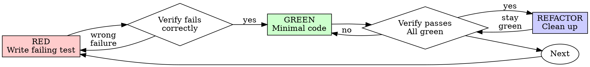

# test-driven-development: 테스트 주도 개발(TDD)

## 개요

테스트를 먼저 작성하고 실패하는 모습을 확인한 뒤, 통과하는 데 필요한 최소한의 코드를 작성합니다.

**핵심 원칙:** 테스트가 실패하는 모습을 확인하지 않았다면, 그 테스트가 올바른 대상을 검증하는지 알 수 없습니다.

**규칙의 문구를 어기는 것은 규칙의 취지를 어기는 것입니다.**

## 사용 시점

**항상 사용:**
- 새로운 프로덕션 코드 동작
- 코드 버그 수정
- 관찰 가능한 동작을 바꿀 수 있는 리팩터링
- 알고리즘, 상태 전이, 검증 또는 오류 처리 변경

**기본적으로 사용하지 않음:**
- 문서, 산문, 주석 및 문구만 바꾸는 변경
- 정적 metadata와 manifest 수정
- 생성된 코드
- 동작이 바뀌지 않는 formatting, 파일 이동 및 기계적인 이름 변경
- parser나 실제 소비 명령이 더 강하고 저렴한 근거를 제공하는 단순 설정
- 정적 텍스트, metadata 또는 구현을 그대로 비추기만 하는 테스트

이런 변경에는 구문 및 경로 검사, 링크와 예제 검토, native loader 또는 변경된 설정을 실제로 소비하는 최소 명령처럼 위험에 비례한 검증을 사용합니다. 설정이나 metadata 변경이 의미 있는 runtime behavior를 제어한다면 그 동작을 테스트합니다. 파일 형식만 보고 위험이 낮다고 가정하지 않습니다.

이 스킬이 프로덕션 동작 변경에 적용되는 상황에서 "skip TDD just this once"라고 생각하는 것은 합리화입니다.

## 절대 원칙

```
NO PRODUCTION BEHAVIOR CHANGE WITHOUT A FAILING TEST FIRST
```

이 원칙은 위 범위에 따라 변경을 TDD 작업으로 분류한 뒤 적용됩니다.

테스트보다 코드를 먼저 작성했다면 삭제하고 처음부터 다시 시작합니다.

**예외 없음:**
- "reference" 용도로 남겨 두지 않습니다
- 테스트를 작성하면서 기존 코드를 "adapt"하지 않습니다
- 기존 코드를 보지 않습니다
- 삭제는 실제 삭제를 뜻합니다

테스트에서 출발해 새로 구현합니다. 예외는 없습니다.

## RED–GREEN–REFACTOR



### RED - 실패하는 테스트 작성

기대하는 동작을 보여 주는 최소한의 테스트 하나를 작성합니다.

<Good>
```typescript
test('retries failed operations 3 times', async () => {
  let attempts = 0;
  const operation = () => {
    attempts++;
    if (attempts < 3) throw new Error('fail');
    return 'success';
  };

  const result = await retryOperation(operation);

  expect(result).toBe('success');
  expect(attempts).toBe(3);
});
```
이름이 명확하고 실제 동작 하나를 검증함
</Good>

<Bad>
```typescript
test('retry works', async () => {
  const mock = jest.fn()
    .mockRejectedValueOnce(new Error())
    .mockRejectedValueOnce(new Error())
    .mockResolvedValueOnce('success');
  await retryOperation(mock);
  expect(mock).toHaveBeenCalledTimes(3);
});
```
이름이 모호하고 코드가 아니라 mock을 검증함
</Bad>

**요구사항:**
- 하나의 동작
- 명확한 이름
- 실제 코드(피할 수 없는 경우가 아니라면 mock 금지)

### RED 검증 - 실패하는 모습 확인

**필수입니다. 절대 건너뛰지 않습니다.**

```bash
npm test path/to/test.test.ts
```

다음을 확인합니다.
- 테스트가 실패함(error가 아님)
- 실패 메시지가 예상과 일치함
- 오타가 아니라 기능이 없어서 실패함

**테스트가 통과합니까?** 기존 동작을 검증하고 있는 것입니다. 테스트를 수정합니다.

**테스트에서 error가 발생합니까?** error를 수정하고 올바르게 실패할 때까지 다시 실행합니다.

### GREEN - 최소 코드

테스트를 통과하는 가장 단순한 코드를 작성합니다.

<Good>
```typescript
async function retryOperation<T>(fn: () => Promise<T>): Promise<T> {
  for (let i = 0; i < 3; i++) {
    try {
      return await fn();
    } catch (e) {
      if (i === 2) throw e;
    }
  }
  throw new Error('unreachable');
}
```
통과하는 데 필요한 만큼만 작성함
</Good>

<Bad>
```typescript
async function retryOperation<T>(
  fn: () => Promise<T>,
  options?: {
    maxRetries?: number;
    backoff?: 'linear' | 'exponential';
    onRetry?: (attempt: number) => void;
  }
): Promise<T> {
  // YAGNI
}
```
과도하게 설계됨
</Bad>

기능을 추가하거나 다른 코드를 리팩터링하거나 테스트 범위를 넘어 "improve"하지 않습니다.

### GREEN 검증 - 통과하는 모습 확인

**필수입니다.**

```bash
npm test path/to/test.test.ts
```

다음을 확인합니다.
- 테스트가 통과함
- 다른 테스트도 계속 통과함
- 출력이 깨끗함(error와 warning 없음)

**테스트가 실패합니까?** 테스트가 아니라 코드를 수정합니다.

**다른 테스트가 실패합니까?** 즉시 수정합니다.

### REFACTOR - 정리

GREEN 상태가 된 뒤에만 다음을 수행합니다.
- 중복 제거
- 이름 개선
- helper 추출

테스트가 계속 통과하게 유지합니다. 동작을 추가하지 않습니다.

### 반복

다음 기능을 위한 다음 실패 테스트를 작성합니다.

## 좋은 테스트

| 품질 | 좋은 예 | 나쁜 예 |
|---------|------|-----|
| **최소성** | 한 가지만 검증합니다. 이름에 "and"가 있습니까? 테스트를 나눕니다. | `test('validates email and domain and whitespace')` |
| **명확성** | 이름이 동작을 설명합니다 | `test('test1')` |
| **의도 표현** | 원하는 API를 보여 줍니다 | 코드가 무엇을 해야 하는지 감춥니다 |

테스트를 작성하거나 변경할 때는 테스트를 정직하게 유지하는 규칙을 다룬 [writing-good-tests.md](writing-good-tests.md)를 읽습니다.
- 테스트를 작성하기 전에 그 테스트를 실패하게 만들 프로덕션 변경을 명시합니다
- mock의 동작이 아니라 실제 동작을 assertion합니다
- 테스트 전용 코드는 프로덕션 class가 아닌 테스트 utility에 둡니다
- dependency를 mock하기 전에 그 side effect를 이해합니다

## 흔한 합리화

| 핑계 | 실제 |
|--------|---------|
| "Too simple to test" | 단순한 코드도 망가집니다. 테스트에는 30초면 충분합니다. |
| "I'll test after" | 나중에 작성한 테스트는 즉시 통과하므로 아무것도 증명하지 못합니다. 잘못된 대상을 검증하거나 동작 대신 구현을 검증하거나 잊어버린 edge case를 놓칠 수 있습니다. 실패하는 모습을 보지 않았으므로 버그를 잡을 수 있다는 사실을 증명하지 못했습니다. 테스트 우선 접근은 그 실패를 강제합니다. |
| "Tests after achieve same goals (spirit not ritual)" | 사후 테스트는 "what does this do?"에 답하고, 테스트 우선은 "what should this do?"에 답합니다. 나중에 작성한 테스트는 이미 작성한 코드에 편향되어 발견했을 사례가 아니라 기억한 사례만 검증합니다. 테스트가 실제로 작동한다는 증거 없는 coverage일 뿐입니다. |
| "Already manually tested" | 수동 테스트는 임시방편입니다. 무엇을 검증했는지 기록이 없고, 코드 변경 후 다시 실행할 방법이 없으며, 압박 속에서 사례를 잊기 쉽습니다. "Worked when I tried it"이 포괄적인 검증을 뜻하지는 않습니다. 자동화 테스트는 매번 같은 방식으로 실행됩니다. |
| "Deleting X hours is wasteful" | 매몰 비용의 오류입니다. 그 시간은 어느 쪽이든 이미 지출했습니다. 실제 선택은 TDD로 다시 작성해 높은 신뢰도를 얻거나, 기존 코드를 유지한 채 사후 테스트를 덧붙여 낮은 신뢰도와 버그 가능성을 감수하는 것입니다. 신뢰할 수 없는 코드를 유지하는 일이 낭비입니다. |
| "Keep as reference, write tests first" | 결국 기존 코드를 적용하게 됩니다. 그것은 사후 테스트입니다. 삭제는 실제 삭제를 뜻합니다. |
| "Need to explore first" | 괜찮습니다. 탐색 결과를 버리고 TDD로 다시 시작합니다. |
| "Test hard = design unclear" | 테스트가 보내는 신호를 따릅니다. 테스트하기 어렵다면 사용하기도 어렵습니다. |
| "TDD will slow me down" | TDD는 실용적인 경로입니다. 커밋 전에 버그를 잡고, 회귀를 방지하며, 두려움 없이 리팩터링하게 해 줍니다. "Pragmatic" shortcut은 프로덕션에서 디버깅한다는 뜻이며 오히려 더 느립니다. |
| "Manual test faster" | 수동 테스트는 edge case를 증명하지 못합니다. 변경할 때마다 다시 테스트해야 합니다. |
| "Existing code has no tests" | 지금 코드를 개선하고 있습니다. 기존 코드에 대한 테스트를 추가합니다. |

## 위험 신호 - 중단하고 다시 시작

TDD가 적용되는 프로덕션 동작 변경에서 다음 상황을 확인합니다.

- 테스트보다 코드를 먼저 작성함
- 구현 뒤에 테스트를 작성함
- 테스트가 즉시 통과함
- 테스트가 실패한 이유를 설명할 수 없음
- 테스트를 "later"에 추가함
- "just this once"라고 합리화함
- "I already manually tested it"
- "Tests after achieve the same purpose"
- "It's about spirit not ritual"
- "Keep as reference" 또는 "adapt existing code"
- "Already spent X hours, deleting is wasteful"
- "TDD is dogmatic, I'm being pragmatic"
- "This is different because..."

**이 중 하나라도 해당하면 코드를 삭제하고 TDD로 다시 시작합니다.**

## 예시: 버그 수정

**버그:** 빈 email이 허용됨

**RED**
```typescript
test('rejects empty email', async () => {
  const result = await submitForm({ email: '' });
  expect(result.error).toBe('Email required');
});
```

**RED 검증**
```bash
$ npm test
FAIL: expected 'Email required', got undefined
```

**GREEN**
```typescript
function submitForm(data: FormData) {
  if (!data.email?.trim()) {
    return { error: 'Email required' };
  }
  // ...
}
```

**GREEN 검증**
```bash
$ npm test
PASS
```

**REFACTOR**
필요하다면 여러 field의 검증을 추출합니다.

## 검증 체크리스트

TDD 범위의 작업을 완료로 표시하기 전에 확인합니다.

- [ ] 새로 추가하거나 변경한 모든 동작에 테스트가 있음
- [ ] 구현하기 전에 각 테스트가 실패하는 모습을 확인함
- [ ] 각 테스트가 예상한 이유로 실패함(오타가 아니라 기능 부재)
- [ ] 각 테스트를 통과하는 최소 코드를 작성함
- [ ] 모든 테스트가 통과함
- [ ] 출력이 깨끗함(error와 warning 없음)
- [ ] 테스트가 실제 코드를 사용함(피할 수 없는 경우에만 mock 사용)
- [ ] edge case와 error를 다룸

모든 항목을 확인할 수 없다면 TDD를 건너뛴 것입니다. 다시 시작합니다.

## 막혔을 때

| 문제 | 해결책 |
|---------|----------|
| 테스트 방법을 모름 | 원하는 API를 작성합니다. assertion을 먼저 작성합니다. 사람 협업자에게 묻습니다. |
| 테스트가 너무 복잡함 | 설계가 너무 복잡합니다. interface를 단순화합니다. |
| 모든 것을 mock해야 함 | 코드가 지나치게 결합되어 있습니다. dependency injection을 사용합니다. |
| 테스트 setup이 너무 큼 | helper를 추출합니다. 여전히 복잡하다면 설계를 단순화합니다. |

## 디버깅과 통합

코드 버그를 발견했다면 이를 재현하는 실패 테스트를 작성합니다. TDD cycle을 따릅니다. 이 테스트는 수정 사항을 증명하고 회귀를 방지합니다.

환경 때문에 자동화가 불가능하지 않은 한, 재현 가능한 코드 결함을 regression test 없이 수정하지 않습니다. 자동화가 불가능하다면 제약을 기록하고 대신 가능한 가장 강한 재현 절차를 실행합니다.

## 최종 규칙

```
Production behavior change → test exists and failed first
Non-behavior change → proportionate verification
```

분류가 불명확하다면 변경된 artifact를 무엇이 소비하는지 확인하고, 올바른 이유로 실패할 수 있는 가장 작은 검증을 선택합니다.
