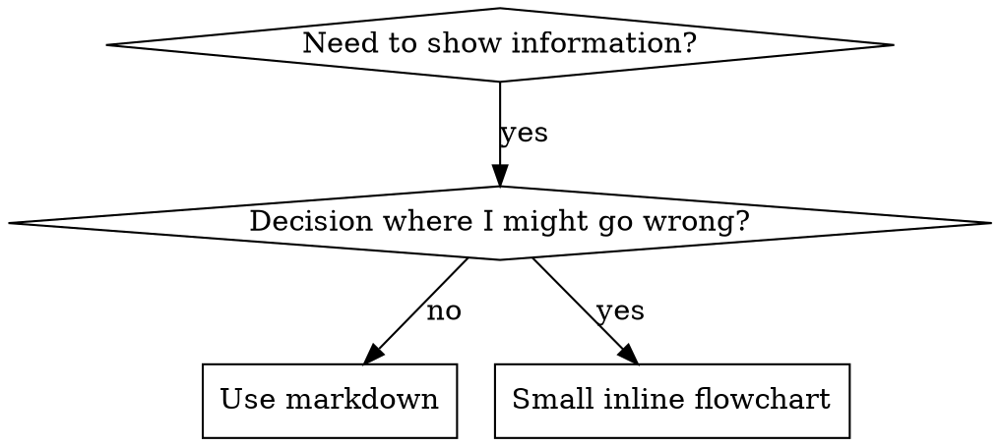

# writing-skills: 스킬 작성하기

## 개요

스킬 변경에는 영향을 줄 수 있는 동작에 비례한 검증이 필요합니다. 단순한 metadata 또는 참고 문서 수정에는 frontmatter, 경로, 링크 및 loading 검사가 충분합니다. routing, permission, safety 또는 여러 단계의 workflow 변경에는 현실적인 agent scenario가 필요할 수 있습니다.

**개인 스킬은 runtime의 skills directory에 둡니다**(Claude Code에서는 `~/.claude/skills/`). 다른 runtime의 경로는 [codex-tools.md](../using-engineering-skills/references/codex-tools.md) 또는 [gemini-tools.md](../using-engineering-skills/references/gemini-tools.md)를 참고합니다. Codex, Copilot CLI 및 Gemini CLI는 모두 `~/.agents/skills/`도 cross-runtime alias로 인식합니다.

동작 형성에 큰 영향을 주는 고위험 지침에는 새로운 agent를 대상으로 pressure scenario를 사용할 수 있습니다. 관련 baseline failure를 관찰하고, 집중된 지침을 작성하고, 개선을 검증하고, 실제로 드러난 loophole을 막습니다.

**핵심 원칙:** 스킬의 중대한 실패를 드러낼 수 있는 가장 저렴한 검사를 사용합니다.

**공식 지침:** Anthropic의 공식 skill authoring best practice는 anthropic-best-practices.md를 참고합니다. 아래의 behavioral evaluation 내용은 위험상 필요성이 있는 변경을 위한 고급 방법이며, 모든 수정에 의무적으로 적용하는 절차가 아닙니다.

## 스킬이란 무엇인가

**스킬**은 검증된 technique, pattern 또는 tool을 위한 참고 안내서입니다. 스킬은 이후 agent가 효과적인 접근 방식을 찾아 적용하도록 돕습니다.

**스킬에 해당하는 것:** 재사용 가능한 technique, pattern, tool, reference guide

**스킬에 해당하지 않는 것:** 한 번의 문제 해결 과정을 서술한 이야기

## Behavioral evaluation 대응 관계

| TDD 개념 | 스킬 작성 |
|-------------|----------------|
| **테스트 사례** | subagent를 사용한 pressure scenario |
| **프로덕션 코드** | 스킬 문서(SKILL.md) |
| **테스트 실패(RED)** | 스킬이 없을 때 agent가 규칙을 어김(baseline) |
| **테스트 통과(GREEN)** | 스킬이 있을 때 agent가 규칙을 따름 |
| **리팩터링** | compliance를 유지하면서 loophole을 막음 |
| **테스트 먼저 작성** | 스킬을 작성하기 전에 baseline scenario 실행 |
| **실패 확인** | agent가 사용하는 정확한 합리화를 기록 |
| **최소 코드** | 해당 위반을 직접 다루는 스킬 작성 |
| **통과 확인** | agent가 이제 규칙을 따르는지 검증 |
| **리팩터링 주기** | 새로운 합리화 찾기 → 차단 → 재검증 |

스킬이 중요한 agent behavior를 바꾸려는 것이며 static check만으로 신뢰를 확보할 수 없을 때 이 cycle을 사용합니다. 일반적인 문구, metadata, 경로 및 reference 유지보수에는 baseline-failure experiment가 필요하지 않습니다.

## 스킬을 만들 시점

**다음 상황에서 만듭니다.**
- technique가 직관적으로 명확하지 않았음
- 여러 project에서 다시 참고할 내용임
- pattern이 특정 project에 한정되지 않고 널리 적용됨
- 다른 사람에게 도움이 됨

**다음 대상에는 만들지 않습니다.**
- 일회성 해결책
- 다른 곳에 잘 문서화된 표준 관행
- project별 convention(지침 파일에 둡니다)
- 기계적인 constraint(regex/validation으로 강제할 수 있다면 자동화하고, 판단이 필요한 내용만 문서화합니다)

## 스킬 유형

### Technique(기법)
따라야 할 단계가 있는 구체적인 방법(condition-based-waiting, root-cause-tracing)

### Pattern(패턴)
문제를 바라보는 사고방식(flatten-with-flags, test-invariants)

### Reference(참고 자료)
API 문서, 문법 가이드, 도구 문서(office 문서)

## Directory 구조


```
skills/
  skill-name/
    SKILL.md              # Main reference (required)
    supporting-file.*     # Only if needed
```

**Flat namespace** - 모든 스킬을 검색 가능한 하나의 namespace에 둡니다

**다음은 별도 파일로 분리합니다.**
1. **무거운 reference**(100줄 이상) - API docs, 포괄적인 syntax
2. **재사용 가능한 tool** - script, utility, template

**다음은 inline으로 유지합니다.**
- 원칙과 개념
- code pattern(50줄 미만)
- 그 밖의 모든 내용

## SKILL.md 구조

**Frontmatter(YAML):**
- 필수 field 2개: `name`과 `description`(지원하는 전체 field는 [agentskills.io/specification](https://agentskills.io/specification) 참고)
- 전체 최대 1024자
- `name`: letter, number 및 hyphen만 사용(parenthesis나 special character 금지)
- `description`: 3인칭으로 작성하고 무엇을 하는지가 아니라 사용하는 시점만 설명
  - 사용하는 시점을 조건형으로 명확히 씁니다(영문은 "Use when...", 한국어는 "...할 때 사용한다")
  - 구체적인 symptom, situation 및 context를 포함합니다
  - **스킬의 process나 workflow를 절대 요약하지 않습니다**(이유는 SDO 섹션 참고)
  - 가능하면 500자 미만으로 유지합니다

```markdown
---
name: Skill-Name-With-Hyphens
description: Use when [specific triggering conditions and symptoms]
---

# Skill Name

## Overview
What is this? Core principle in 1-2 sentences.

## When to Use
[Small inline flowchart IF decision non-obvious]

Bullet list with SYMPTOMS and use cases
When NOT to use

## Core Pattern (for techniques/patterns)
Before/after code comparison

## Quick Reference
Table or bullets for scanning common operations

## Implementation
Inline code for simple patterns
Link to file for heavy reference or reusable tools

## Common Mistakes
What goes wrong + fixes

## Real-World Impact (optional)
Concrete results
```


## Skill Discovery Optimization(SDO, 스킬 검색 최적화)

**검색에 중요:** 이후 agent가 스킬을 찾을 수 있어야 합니다

### 1. 풍부한 description field

**목적:** agent는 description을 읽고 주어진 task에 어떤 skill을 불러올지 결정합니다. "Should I read this skill right now?"에 답할 수 있게 작성합니다.

**형식:** 사용하는 시점을 조건형으로 명확히 씁니다(영문은 "Use when...", 한국어는 "...할 때 사용한다")

**중요: Description은 스킬이 무엇을 하는지가 아니라 사용 시점을 나타냅니다**

description에는 trigger condition만 설명해야 합니다. description에 스킬의 process나 workflow를 요약하지 않습니다.

**중요한 이유:** 테스트 결과 description에 스킬의 workflow를 요약하면 agent가 전체 skill 내용을 읽지 않고 description만 따를 수 있었습니다. "code review between tasks"라는 description 때문에 skill flowchart에 두 번의 review(spec compliance 후 code quality)가 명확히 표시되어 있는데도 agent는 review를 한 번만 수행했습니다.

description을 workflow 요약이 없는 "Use when executing implementation plans with independent tasks"로 바꾸자 agent는 flowchart를 올바르게 읽고 두 단계 review process를 따랐습니다.

**함정:** workflow를 요약한 description은 agent가 택할 shortcut을 만듭니다. skill body는 agent가 건너뛰는 문서가 됩니다.

```yaml
# ❌ BAD: Summarizes workflow - agents may follow this instead of reading skill
description: Use when executing plans - dispatches subagent per task with code review between tasks

# ❌ BAD: Too much process detail
description: Use for TDD - write test first, watch it fail, write minimal code, refactor

# ✅ GOOD: Just triggering conditions, no workflow summary
description: Use when executing implementation plans with independent tasks in the current session

# ✅ GOOD: Triggering conditions only
description: Use when implementing any feature or bugfix, before writing implementation code
```

**내용:**
- 스킬 적용을 알리는 구체적인 trigger, symptom 및 situation을 사용합니다
- 특정 언어의 symptom(setTimeout, sleep)이 아니라 *문제*(race condition, 일관되지 않은 동작)를 설명합니다
- 스킬 자체가 특정 technology용이 아니라면 trigger를 technology-agnostic하게 유지합니다
- 특정 technology용 skill이라면 trigger에 이를 명시합니다
- system prompt에 주입되므로 3인칭으로 작성합니다
- **스킬의 process나 workflow를 절대 요약하지 않습니다**

```yaml
# ❌ BAD: Too abstract, vague, doesn't include when to use
description: For async testing

# ❌ BAD: First person
description: I can help you with async tests when they're flaky

# ❌ BAD: Mentions technology but skill isn't specific to it
description: Use when tests use setTimeout/sleep and are flaky

# ✅ GOOD: Starts with "Use when", describes problem, no workflow
description: Use when tests have race conditions, timing dependencies, or pass/fail inconsistently

# ✅ GOOD: Technology-specific skill with explicit trigger
description: Use when using React Router and handling authentication redirects
```

### 2. Keyword coverage(검색어 범위)

agent가 검색할 단어를 사용합니다.
- 오류 메시지: "Hook timed out", "ENOTEMPTY", "race condition"
- 증상: "flaky", "hanging", "zombie", "pollution"
- 동의어: "timeout/hang/freeze", "cleanup/teardown/afterEach"
- tool: 실제 command, library name, file type

### 3. 설명적인 이름

**능동태와 동사를 앞에 사용합니다.**
- ✅ `skill-creation`이 아니라 `creating-skills`
- ✅ `async-test-helpers`가 아니라 `condition-based-waiting`

### 4. Token 효율성(중요)

**문제:** getting-started 및 자주 참조되는 스킬은 모든 conversation에 불러옵니다. 모든 token이 중요합니다.

**목표 단어 수:**
- getting-started workflow: 각 150단어 미만
- 자주 불러오는 skill: 전체 200단어 미만
- 그 밖의 skill: 500단어 미만(여전히 간결하게 작성)

**방법:**

**세부 내용을 tool help로 이동:**
```bash
# ❌ BAD: Document all flags in SKILL.md
search-conversations supports --text, --both, --after DATE, --before DATE, --limit N

# ✅ GOOD: Reference --help
search-conversations supports multiple modes and filters. Run --help for details.
```

**cross-reference 사용:**
```markdown
# ❌ BAD: Repeat workflow details
When searching, dispatch subagent with template...
[20 lines of repeated instructions]

# ✅ GOOD: Reference other skill
Always use subagents (50-100x context savings). REQUIRED: Use [other-skill-name] for workflow.
```

**예시 압축:**
```markdown
# ❌ BAD: Verbose example (42 words)
your human partner: "How did we handle authentication errors in React Router before?"
You: I'll search past conversations for React Router authentication patterns.
[Dispatch subagent with search query: "React Router authentication error handling 401"]

# ✅ GOOD: Minimal example (20 words)
Partner: "How did we handle auth errors in React Router?"
You: Searching...
[Dispatch subagent → synthesis]
```

**중복 제거:**
- cross-reference한 skill의 내용을 반복하지 않습니다
- command만으로 명확한 내용을 설명하지 않습니다
- 같은 pattern의 예시를 여러 개 포함하지 않습니다

**검증:**
```bash
wc -w skills/path/SKILL.md
# getting-started workflows: aim for <150 each
# Other frequently-loaded: aim for <200 total
```

**수행하는 일이나 핵심 insight로 이름을 정합니다.**
- ✅ `condition-based-waiting` > `async-test-helpers`
- ✅ `skill-usage`가 아니라 `using-skills`
- ✅ `flatten-with-flags` > `data-structure-refactoring`
- ✅ `root-cause-tracing` > `debugging-techniques`

**process에는 동명사(-ing)가 잘 맞습니다.**
- `creating-skills`, `testing-skills`, `debugging-with-logs`
- 능동적이며 수행하는 action을 설명합니다

### 5. 다른 스킬 cross-reference하기

**다른 스킬을 참조하는 문서를 작성할 때:**

명시적인 requirement marker와 skill name만 사용합니다.
- ✅ 좋은 예: `**REQUIRED SUB-SKILL:** Use engineering:test-driven-development`
- ✅ 좋은 예: `**REQUIRED BACKGROUND:** You MUST understand engineering:systematic-debugging`
- ❌ 나쁜 예: `See skills/testing/test-driven-development`(필수인지 불분명함)
- ❌ 나쁜 예: `@skills/testing/test-driven-development/SKILL.md`(강제로 불러와 context를 소모함)

**@ link를 사용하지 않는 이유:** `@` syntax는 필요하기도 전에 파일을 즉시 강제로 불러와 200k 이상의 context를 소모합니다.

## Flowchart 사용



**flowchart는 다음 용도로만 사용합니다.**
- 명확하지 않은 decision point
- 너무 일찍 멈출 수 있는 process loop
- "When to use A vs B" 결정

**flowchart를 다음 용도로 사용하지 않습니다.**
- 참고 자료 → 표, 목록
- 코드 예시 → Markdown 블록
- 선형 instruction → numbered list
- 의미가 없는 label(step1, helper2)

graphviz style rule은 이 directory의 `graphviz-conventions.dot`를 참고합니다.

**사람 협업자를 위한 시각화:** 이 directory의 `render-graphs.js`를 사용해 skill의 flowchart를 SVG로 render합니다.
```bash
./render-graphs.js ../some-skill           # Each diagram separately
./render-graphs.js ../some-skill --combine # All diagrams in one SVG
```

## 코드 예시

**훌륭한 예시 하나가 평범한 예시 여러 개보다 낫습니다**

가장 관련성 높은 언어를 선택합니다.
- 테스트 기법 → TypeScript/JavaScript
- 시스템 디버깅 → Shell/Python
- 데이터 처리 → Python

**좋은 예시:**
- 완전하며 실행할 수 있음
- 이유를 설명하는 주석이 잘 작성됨
- 실제 scenario에서 가져옴
- pattern을 명확히 보여 줌
- 적용할 준비가 되어 있음(generic template이 아님)

**하지 않을 일:**
- 5개 이상의 언어로 구현
- 빈칸을 채우는 template 작성
- 억지로 만든 예시 작성

porting은 어렵지 않으므로 훌륭한 예시 하나면 충분합니다.

## 파일 구성

### 독립적인 스킬
```
defense-in-depth/
  SKILL.md    # Everything inline
```
적용 시점: 모든 내용을 담을 수 있고 무거운 reference가 필요하지 않을 때

### 재사용 가능한 tool이 있는 스킬
```
condition-based-waiting/
  SKILL.md    # Overview + patterns
  example.ts  # Working helpers to adapt
```
적용 시점: tool이 단순한 설명이 아니라 재사용 가능한 코드일 때

### 무거운 reference가 있는 스킬
```
pptx/
  SKILL.md       # Overview + workflows
  pptxgenjs.md   # 600 lines API reference
  ooxml.md       # 500 lines XML structure
  scripts/       # Executable tools
```
적용 시점: reference material이 너무 커서 inline으로 둘 수 없을 때

## 검증 정책

위험과 변경 유형에 따라 검증을 선택합니다.

| 변경 | 필요한 근거 |
| --- | --- |
| Frontmatter 또는 metadata | parse하고 사용 가능한 skill validator를 실행합니다 |
| 경로, 링크 또는 supporting reference | 변경된 모든 경로를 resolve하고 link target을 확인합니다 |
| routing에 영향을 주지 않는 reference 문구 | 정확성, 범위 및 내부 일관성을 검토합니다 |
| trigger, permission, safety 또는 workflow behavior | 불확실성을 실질적으로 줄일 때 현실적인 scenario를 사용합니다 |
| script 또는 executable helper | 관찰 가능한 동작을 대상으로 집중된 테스트를 실행합니다 |

절차의 비유를 충족한다는 이유만으로 subagent evaluation, 반복 model call 또는 인위적인 failing baseline을 만들지 않습니다. behavioral evaluation이 필요할 때는 아래 RED-GREEN-REFACTOR mapping을 사용하고 정확한 근거를 보존합니다.

## 모든 스킬 유형 테스트하기

skill 유형마다 서로 다른 test approach가 필요합니다.

### 규율을 강제하는 스킬(rule/requirement)

**예시:** TDD, verification-before-completion, designing-before-coding

**테스트 방법:**
- academic question: 규칙을 이해합니까?
- pressure scenario: 압박 속에서도 따릅니까?
- 여러 pressure 조합: time + sunk cost + exhaustion
- 합리화를 식별하고 명시적인 counter를 추가합니다

**성공 기준:** agent가 최대 압박 속에서도 규칙을 따름

### Technique 스킬(how-to guide)

**예시:** condition-based-waiting, root-cause-tracing, defensive-programming

**테스트 방법:**
- application scenario: technique를 올바르게 적용할 수 있습니까?
- variation scenario: edge case를 처리합니까?
- missing information test: instruction에 빈틈이 있습니까?

**성공 기준:** agent가 새로운 scenario에 technique를 성공적으로 적용함

### Pattern 스킬(mental model)

**예시:** reducing-complexity, information-hiding concepts

**테스트 방법:**
- recognition scenario: pattern이 적용되는 시점을 알아봅니까?
- application scenario: mental model을 사용할 수 있습니까?
- counter-example: 적용하지 말아야 할 때를 압니까?

**성공 기준:** agent가 pattern을 적용할 시점과 방법을 올바르게 식별함

### Reference 스킬(documentation/API)

**예시:** API documentation, command reference, library guide

**테스트 방법:**
- retrieval scenario: 올바른 정보를 찾을 수 있습니까?
- application scenario: 찾은 정보를 올바르게 사용할 수 있습니까?
- gap testing: 일반적인 use case를 다룹니까?

**성공 기준:** agent가 reference 정보를 찾아 올바르게 적용함

## Behavioral testing이 필요할 때 흔한 합리화

| 핑계 | 실제 |
|--------|---------|
| "Skill is obviously clear" | 자신에게 명확한 것과 다른 agent에게 명확한 것은 다릅니다. 테스트합니다. |
| "It's just a reference" | reference에는 빈틈이나 불명확한 section이 있을 수 있습니다. retrieval을 테스트합니다. |
| "Testing is overkill" | 중요한 routing, permission 또는 safety behavior에서는 static check만으로 compliance를 입증할 수 없습니다. |
| "I'll test if problems emerge" | 문제가 생겼다는 것은 agent가 skill을 사용할 수 없다는 뜻입니다. 배포 전에 테스트합니다. |
| "Too tedious to test" | 테스트가 프로덕션에서 잘못된 skill을 디버깅하는 것보다 덜 번거롭습니다. |
| "I'm confident it's good" | 지나친 확신은 문제를 만듭니다. 그래도 테스트합니다. |
| "Academic review is enough" | 읽기와 사용은 다릅니다. application scenario를 테스트합니다. |
| "No time to test" | 테스트하지 않은 skill을 배포하면 나중에 수정하는 데 더 많은 시간을 낭비합니다. |

이 항목은 변경을 behavioral evaluation이 필요한 대상으로 분류한 뒤에만 위험 신호가 됩니다.

## 실패 유형에 형식 맞추기

지침을 작성하기 전에 baseline failure를 분류합니다. 한 실패 유형을 견고하게 막는 형식이 다른 유형에는 측정 가능한 역효과를 낼 수 있습니다.

| Baseline failure | 올바른 형식 | 잘못된 형식 |
|---|---|---|
| 압박 속에서 규칙을 건너뛰거나 위반함(규칙을 알면서도 위반) | prohibition + rationalization table + red flag(아래 Bulletproofing 참고) | 부드러운 지침("prefer...", "consider...") |
| 규칙은 따르지만 output 형식이 잘못됨(비대한 prompt, 묻힌 verdict, spec 반복) | 긍정적인 recipe 또는 contract: output의 구성 요소와 순서를 명시 | prohibition list("don't restate", "never narrate") |
| 이미 생성하는 대상에서 필수 요소를 누락함 | 구조적 형식: 채워야 하는 template에 REQUIRED field 또는 slot 제공 | template 주변의 산문형 reminder |
| condition에 따라 동작이 달라져야 함 | 관찰 가능한 predicate에 연결된 conditional("if the brief exists, reference it") | 무조건적인 rule + exemption clause |

**형태를 잡는 문제에서 prohibition이 역효과를 내는 이유:** "make the prompt self-contained" 같은 경쟁 동기가 있으면 agent는 "don't X"와 타협합니다. dispatch-prompt 지침의 문구를 직접 비교한 테스트에서는 prohibition 방식이 recipe 방식보다 원하지 않는 내용을 분명히 더 많이 만들었고(distribution이 완전히 분리됨), 지침이 없는 control보다도 나쁜 경향을 보였습니다. 가정하지 말고 자신의 사례를 micro-test하되, 기본적으로 prohibition을 선택하지 않습니다. recipe는 타협할 여지를 남기지 않습니다. output이 명시한 형식에 맞거나 맞지 않을 뿐입니다.

**어떤 형식을 선택하든 적용할 규칙:**
- **nuance clause를 사용하지 않습니다.** "Don't X unless it matters"는 타협을 다시 허용합니다. 같은 wording test에서 효과적인 recipe에 nuance clause 하나만 추가해도 일관된 결과가 불안정해졌습니다. 실제 예외는 관찰 가능한 predicate를 기준으로 한 별도의 conditional로 표현합니다.
- **exemption clause는 scope를 한정하지 못합니다.** "This limit doesn't apply to code blocks"라고 해도 code block이 억제됩니다. output 일부를 제외해야 한다면 rule이 그 부분에 닿을 수 없게 구조를 바꿉니다.

## 합리화를 막도록 스킬 강화하기

TDD처럼 규율을 강제하는 스킬은 합리화에 저항해야 합니다. agent는 영리하며 압박을 받으면 loophole을 찾습니다.

**범위:** 이 toolkit은 규칙을 알면서도 압박 속에서 건너뛰는 discipline failure를 위한 것입니다. 잘못된 output 형식이나 누락된 요소에는 prohibition 기반 강화가 역효과를 냅니다. 대신 실패 유형에 형식 맞추기 섹션의 방식을 사용합니다.

**심리학 참고:** 설득 기법이 작동하는 이유를 이해하면 이를 체계적으로 적용할 수 있습니다. authority, commitment, scarcity, social proof 및 unity principle에 관한 연구 기반(Cialdini, 2021; Meincke et al., 2025)은 persuasion-principles.md를 참고합니다.

### 모든 loophole을 명시적으로 막기

규칙만 설명하지 말고 구체적인 workaround를 금지합니다.

<Bad>
```markdown
Write code before test? Delete it.
```
</Bad>

<Good>
```markdown
Write code before test? Delete it. Start over.

**No exceptions:**
- Don't keep it as "reference"
- Don't "adapt" it while writing tests
- Don't look at it
- Delete means delete
```
</Good>

### "Spirit vs Letter" 주장 다루기

근본 원칙을 앞부분에 추가합니다.

```markdown
**Violating the letter of the rules is violating the spirit of the rules.**
```

이는 "I'm following the spirit" 유형의 합리화를 모두 차단합니다.

### 합리화 표 만들기

baseline testing에서 나온 합리화를 수집합니다(아래 Testing 섹션 참고). agent가 제시한 모든 핑계를 표에 넣습니다.

```markdown
| Excuse | Reality |
|--------|---------|
| "Too simple to test" | Simple code breaks. Test takes 30 seconds. |
| "I'll test after" | Tests passing immediately prove nothing. |
| "Tests after achieve same goals" | Tests-after = "what does this do?" Tests-first = "what should this do?" |
```

### 위험 신호 목록 만들기

agent가 합리화할 때 쉽게 스스로 점검할 수 있게 합니다.

```markdown
## Red Flags - STOP and Start Over

- Code before test
- "I already manually tested it"
- "Tests after achieve the same purpose"
- "It's about spirit not ritual"
- "This is different because..."

**All of these mean: Delete code. Start over with TDD.**
```

### 위반 symptom에 맞게 SDO 갱신하기

description에 규칙을 위반하려는 시점의 symptom을 추가합니다.

```yaml
description: use when implementing any feature or bugfix, before writing implementation code
```

## 고위험 skill behavior를 위한 RED-GREEN-REFACTOR

behavioral evaluation이 필요하다면 다음 cycle을 따릅니다.

### RED: 실패 테스트 작성(baseline)

스킬 없이 subagent를 대상으로 pressure scenario를 실행합니다. 정확한 동작을 기록합니다.
- 어떤 선택을 했습니까?
- 어떤 합리화를 사용했습니까(verbatim)?
- 어떤 pressure가 위반을 일으켰습니까?

이것이 "watch the test fail"입니다. 스킬을 작성하기 전에 agent가 자연스럽게 어떻게 행동하는지 확인해야 합니다.

### GREEN: 최소 스킬 작성

해당 합리화를 직접 다루는 스킬을 작성합니다. 가상의 사례를 위한 추가 내용을 넣지 않습니다.

스킬을 적용해 같은 scenario를 실행합니다. 이제 agent가 규칙을 따라야 합니다.

### REFACTOR: loophole 막기

agent가 새로운 합리화를 찾았습니까? 명시적인 counter를 추가합니다. 견고해질 때까지 다시 테스트합니다.

### 전체 scenario 전에 문구 micro-test하기

전체 pressure scenario 실행은 비용이 큽니다. model call을 사용할 수 있고 허가되었으며 위험에 비례할 때만 micro-test를 먼저 사용합니다.

1. **호출마다 하나의 fresh-context sample** — raw API call을 사용하거나 API access가 없다면 single-shot subagent를 사용합니다. System prompt는 지침이 실제로 놓일 현실적인 context(분리된 지침이 아니라 전체 skill 또는 prompt template)이고, user message는 실패를 유도하는 task입니다.
2. **attribution이 중요할 때 no-guidance control을 포함합니다.** control에서 의심한 실패가 나타나지 않으면 해당 문구가 문제를 고쳤다고 주장하지 않습니다.
3. **variance가 결정을 바꿀 때만 반복합니다.** sample 하나는 일화에 불과합니다. 여러 sample에는 더 많은 비용과 근거가 필요합니다.
4. **flag된 match를 모두 직접 읽습니다.** 원한다면 program으로 score할 수 있지만 template echo와 인용된 counter-example이 실제 hit처럼 보일 수 있습니다. 자동화된 count만으로는 실패와 성공을 모두 과장합니다.
5. **variance도 metric입니다.** 지침이 효과를 내면 반복 결과가 같은 형태로 수렴합니다. 다섯 번 실행해 다섯 가지 해석이 나온다면 문구가 강제력을 갖지 못한 것입니다. 단어를 더하기 전에 형식을 강화합니다.

micro-test는 문구를 검증하지만 discipline skill의 pressure scenario를 대체하지 않습니다.

**테스트 방법론:** 전체 테스트 방법론은 [testing-skills-with-subagents.md](testing-skills-with-subagents.md)를 참고합니다.
- pressure scenario 작성 방법
- pressure 유형(time, sunk cost, authority, exhaustion)
- 체계적으로 빈틈을 막는 방법
- 메타 테스트 기법

## Anti-pattern(피해야 할 형태)

### ❌ 서사형 예시
"In session 2025-10-03, we found empty projectDir caused..."
**나쁜 이유:** 너무 구체적이며 재사용할 수 없음

### ❌ 여러 언어로 분산
example-js.js, example-py.py, example-go.go
**나쁜 이유:** 평범한 품질과 유지보수 부담

### ❌ Flowchart 안의 코드
```dot
step1 [label="import fs"];
step2 [label="read file"];
```
**나쁜 이유:** copy-paste할 수 없고 읽기 어려움

### ❌ Generic label(일반적인 이름표)
helper1, helper2, step3, pattern4
**나쁜 이유:** label에는 의미가 있어야 함

## 다음 스킬로 넘어가기 전에

다음 스킬로 넘어가기 전에 변경한 각 스킬을 검증합니다. 동일한 deterministic check가 동등한 근거를 만든다면 여러 skill을 한 번에 검사합니다. routing, permission, safety 또는 workflow 변경상 필요한 skill에만 behavioral scenario를 별도로 실행합니다.

## 스킬 작성 체크리스트

**필수:**
- [ ] name에 letter, number, hyphen만 사용함(parenthesis/special character 금지)
- [ ] 필수 `name` 및 `description` field가 있는 YAML frontmatter(최대 1024자, [spec](https://agentskills.io/specification) 참고)
- [ ] description이 사용하는 시점을 조건형으로 명확히 쓰고 구체적인 trigger/symptom을 포함함
- [ ] description을 3인칭으로 작성함
- [ ] 검색을 위한 keyword(error, symptom, tool)가 본문 전반에 있음
- [ ] 핵심 원칙이 있는 명확한 개요
- [ ] 지침 형식이 실패 유형에 맞음(실패 유형에 형식 맞추기 참고)
- [ ] inline code 또는 별도 파일 링크
- [ ] 훌륭한 예시 하나(여러 언어로 분산하지 않음)
- [ ] 사용 가능한 validator를 실행하고 변경된 모든 reference path를 확인함

**품질 검사:**
- [ ] 결정이 명확하지 않을 때만 작은 flowchart 사용
- [ ] 빠른 참고 표
- [ ] 흔한 실수 섹션
- [ ] 서사식 설명 없음
- [ ] supporting file은 tool 또는 무거운 reference에만 사용

**필요한 경우의 behavioral evaluation:**
- [ ] 중대한 실패와 static check만으로 충분하지 않은 이유를 정의함
- [ ] attribution이 중요할 때 baseline 또는 no-guidance control을 실행함
- [ ] 변경된 skill로 현실적인 scenario를 실행함
- [ ] 관찰한 근거와 불확실성을 기록함
- [ ] evaluation에서 드러난 loophole만 막음

**허가되었을 때만 수행할 게시 작업:**
- [ ] 전체 diff 검토
- [ ] 사용자가 명시적으로 허가한 범위에서만 commit, push 또는 PR 생성

## 검색 workflow

이후 agent가 스킬을 찾는 과정은 다음과 같습니다.

1. **문제 발생**("tests are flaky")
2. **skill 검색**(description을 grep하고 category를 살펴봄)
3. **SKILL 발견**(description 일치)
4. **개요 훑어보기**(관련이 있는가?)
5. **pattern 읽기**(빠른 참고 표)
6. **예시 불러오기**(구현할 때만)

**이 flow에 맞게 최적화합니다.** 검색 가능한 용어를 앞부분에 반복해서 배치합니다.
