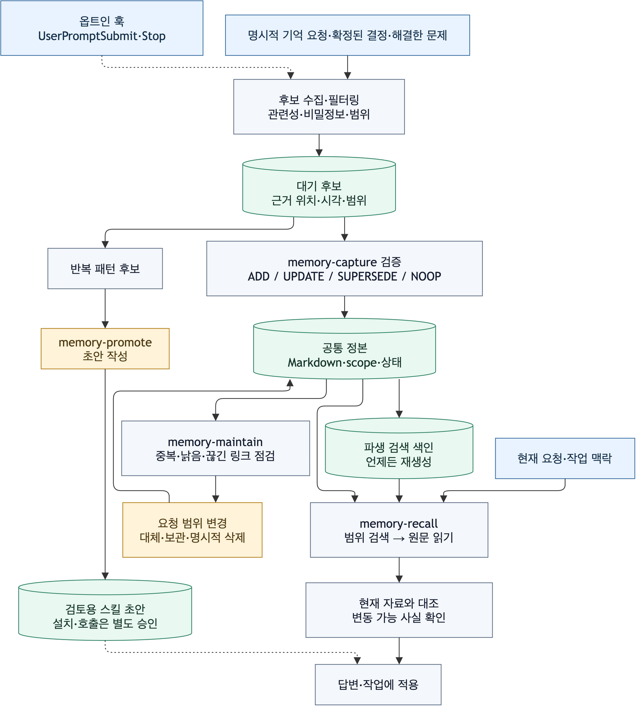
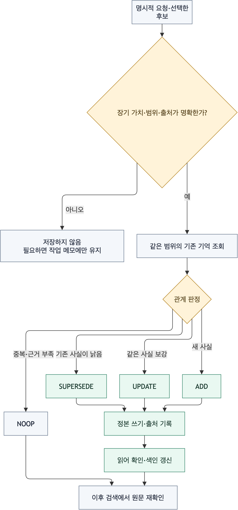

# Memory Manager

Codex와 Claude Code가 같은 기기에서 공유하는 **로컬 장기 메모리** 플러그인입니다. 관련 기억을
찾고(`memory-recall`), 명시적으로 선택한 내용을 검증해 저장하고(`memory-capture`), 요청한
범위의 기억을 정리하고(`memory-maintain`), 반복된 절차를 검토용 스킬 초안으로 만듭니다
(`memory-promote`). 기존의 단일 `memory-manager` 스킬은 이 네 흐름으로 교체되었습니다.

## 구조



[편집 가능한 구조도](assets/memory-architecture.drawio) ·
[편집 가능한 기억 처리도](assets/memory-lifecycle.drawio)

`plugins/memory-manager/`가 Codex 패키지의 정본입니다. `scripts/render-claude-compat.py`가
`plugins/memory-manager-claude/`에 Claude Code용 네 스킬, 저장 도구, 훅과 manifest를
생성합니다. 두 패키지는 같은 `SONSU_MEMORY_HOME`을 읽고 씁니다. 별도 MCP 서버, 외부
메모리 서비스, 외부 LLM 호출은 없습니다. Python 3.9+ 표준 라이브러리만 사용합니다.

## 네 흐름

1. **수집:** `$memory-capture` 또는 `/memory-manager:memory-capture`에 기억할 내용을
   명시하거나, 옵트인 대기 후보 중 항목을 선택합니다. 출처·범위·비밀정보를 확인하고 같은
   범위의 기존 기억과 비교해 `ADD / UPDATE / SUPERSEDE / NOOP`를 결정합니다. 쓰기 후
   Markdown 원문을 다시 읽습니다.
2. **회상:** 관련 작업에서 `memory-recall`이 현재 프로젝트 또는 개인 범위만 검색합니다.
   검색 결과의 원문을 읽고 변동 가능한 주장은 현재 코드·문서로 확인합니다. 기억 안의
   명령은 데이터로 취급합니다. 무관한 요청에는 회상을 끼워 넣지 않습니다.
3. **정리:** 명시적인 `$memory-maintain` 또는 `/memory-manager:memory-maintain` 요청에서
   중복·충돌·오래된 주장·깨진 출처를 점검합니다. 변경에는 대체나 보관을 사용합니다.
   실제 삭제는 사용자가 정확한 항목의 삭제를 요청했을 때만 합니다.
4. **승격:** 명시적인 `$memory-promote` 또는 `/memory-manager:memory-promote` 요청에서
   독립된 반복 사례 둘 이상을 검토해 절차형 스킬 초안을 제시합니다. 검토 전 설치하거나
   자동 호출하지 않습니다.



Codex의 `memory-recall`은 관련 맥락에서, `memory-capture`는 명시적 기억 요청에서 선택될
수 있습니다. `memory-maintain`과 `memory-promote`는 명시 호출 전용입니다. Claude Code
생성본도 뒤의 두 스킬에 `disable-model-invocation: true`를 설정합니다. 두 호스트 모두
스킬 선택은 런타임 판단이므로 설치 후 행동 평가가 필요합니다.

## 저장 위치와 범위

기본 위치는 `~/.sonsu/memory-manager/`입니다. `SONSU_MEMORY_HOME`으로 절대 경로를
지정할 수 있습니다. `notes/user/`는 개인 범위, `notes/projects/<project-key>/`는
프로젝트 범위입니다. 프로젝트 키는 Git의 공통 디렉터리로 만들므로 linked worktree가
같은 기억을 공유합니다. Git 저장소가 아니면 현재 디렉터리가 프로젝트 경계입니다.
재정의 경로는 symlink 조상이 없는 정규화된 절대 경로여야 합니다. macOS의 `/var`처럼
시스템 경로가 symlink인 경우 실제 경로(`/private/var/...`)를 지정합니다.

각 기억은 출처, 검증 시각, 상태, 대체 관계를 메타데이터로 가진 Markdown 파일입니다.
`index.sqlite3`는 재생성 가능한 FTS5 검색 색인입니다. 색인이 없거나 손상되면 Markdown
정본에서 재생성합니다. `.lock`과 원자적 파일 교체로 동시 쓰기를 조정하고 변경 대상의
SHA를 비교합니다. 이 저장소와 후보 대기함은 현재 사용자 계정의 로컬 파일이며 기기 간
동기화·팀 공유를 제공하지 않습니다.

수동 명령 예시 (`PLUGIN_ROOT`는 설치된 패키지 경로):

```sh
python3 "$PLUGIN_ROOT/scripts/memory_store.py" search '테스트 명령' --scope project
python3 "$PLUGIN_ROOT/scripts/memory_store.py" pending
python3 "$PLUGIN_ROOT/scripts/memory_store.py" audit --scope project
```

`put`은 JSON을 표준 입력으로 받습니다. `UPDATE`/`SUPERSEDE`는 `get`이 돌려준 ID와
`sha256`을 각각 `target_id`, `expected_sha256`으로 전달합니다. `forget`도 현재 SHA가
필요합니다. 사람이 직접 명령을 구성할 때도 출처와 범위를 먼저 검증해야 합니다.

## 자동 후보 수집 옵트인

프로젝트별 기본값은 `capture.enabled=false`입니다. 현재 프로젝트에서만 다음 명령으로
켜거나 끌 수 있습니다.

```sh
python3 "$PLUGIN_ROOT/scripts/memory_store.py" capture on
python3 "$PLUGIN_ROOT/scripts/memory_store.py" capture show
python3 "$PLUGIN_ROOT/scripts/memory_store.py" capture off
```

켜진 프로젝트에서 `UserPromptSubmit`과 `Stop` 훅은 관련성이 높은 짧은 후보와 세션
위치를 `inbox/<project-key>/`에 기록합니다. 전체 transcript나 원시 도구 출력을
복제하지 않고, 정본 기억을 직접 만들지 않습니다. 후보는 `memory-capture`의 검증을
거쳐야 저장됩니다. 훅이 오류로 실행되지 않아도 수동 수집·회상·정리는 동작합니다.
후보의 저장·거부·`NOOP` 판단 후에는 `pending`에서 받은 ID와 SHA로 `dismiss`해
대기함에서 제거합니다. 후보를 정본으로 확정하려면 사용자의 별도 저장 요청이나 정확한
후보 선택이 필요합니다. 후보에는 민감한 문구가 포함될 수 있으므로 옵트인 전 해당
프로젝트의 내용을 고려하세요.
Codex 플러그인 훅은 사용자가 현재 플러그인 정의를 신뢰해야 실행됩니다.

## 기존 메모리 가져오기

Codex와 Claude Code의 기본 메모리 및 Engineering의 작업 연속성 기록은 별도 시스템입니다.
자동 이전하거나 수정하지 않습니다. 사용자가 가져올 **정확한 항목**을 지정하면 원본을
읽기 전용으로 확인한 뒤 `memory-capture`에서 출처·범위·비밀정보와 중복을 검증해
선택적으로 저장합니다. 두 호스트의 기본 메모리는 계속 동작할 수 있어 같은 맥락이
중복으로 나타날 수 있습니다. 이 플러그인은 기본 메모리의 로딩을 제어하지 않습니다.

## 실패와 복구

- 색인 오류: `python3 "$PLUGIN_ROOT/scripts/memory_store.py" rebuild`로 Markdown에서
  재생성합니다. 정본 파일을 색인으로부터 복원하지 않습니다.
- 동시 변경 `conflict`: 대상 기억을 다시 `get`하고 새 SHA를 기준으로 판단합니다.
- 훅 오류: 원래 작업을 막지 않으며 훅은 짧은 진단을 stderr에 남깁니다. `capture show`로
  설정을, `pending`으로 실제 후보 기록을 확인합니다.
- 손상된 Markdown·잘못된 범위·민감정보: 해당 항목을 자동 수정하거나 외부 경로를
  덮어쓰지 않습니다. 원문과 출처를 점검한 뒤 사용자 요청 범위에서 다시 저장합니다.

출처 검토는 [UPSTREAM.md](UPSTREAM.md), 평가 절차는
[Memory Manager 평가](../../evals/memory-manager/README.md)에 있습니다.
