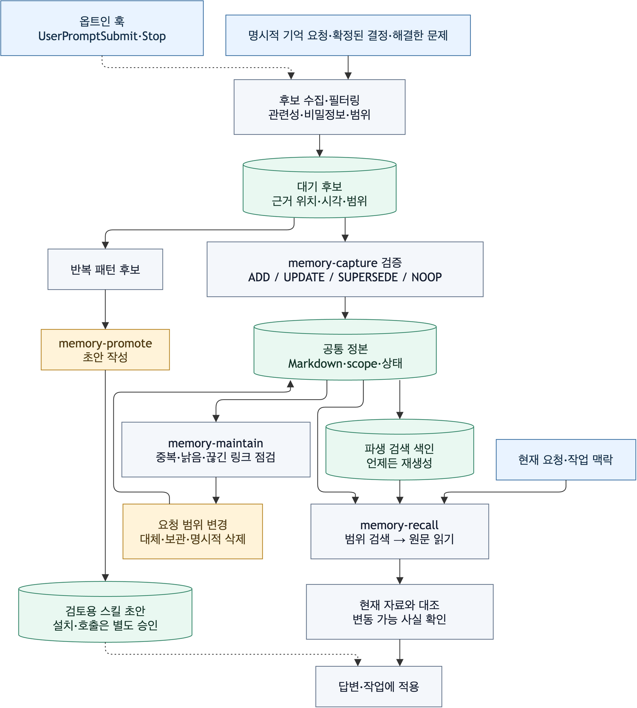
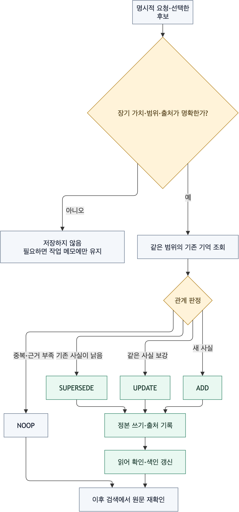

# Memory Manager

Codex와 Claude Code가 같은 기기에서 공유하는 로컬 장기 기억을 조회·저장·정리하고 반복 절차를 검토용 스킬 초안으로 만듭니다.

## 설치

```sh
codex plugin add memory-manager@sonsu-marketplace
claude plugin install memory-manager@sonsu-marketplace
```

Python 3.9+ 표준 라이브러리를 사용하며 별도 MCP 서버·외부 메모리 서비스·외부 LLM 호출이 필요하지 않습니다. omp에서는 기본 memory 기능을 사용합니다.

## 스킬

| 스킬 | 사용할 때 | 결과 |
|---|---|---|
| `memory-recall` | 현재 작업에 과거 결정·절차·선호가 필요할 때 | 출처와 현재 근거를 대조한 맥락 또는 미검증 표시 |
| `memory-capture` | 기억할 내용을 명시하거나 저장할 후보를 정확히 선택했을 때 | `ADD`·`UPDATE`·`SUPERSEDE`·`NOOP` 판정과 실제 저장 확인 |
| `memory-maintain` | 기억 점검·정리를 명시적으로 요청할 때 | 항목별 조치·보류 이유와 허가된 변경 결과 |
| `memory-promote` | 반복된 기억의 절차화를 명시적으로 요청할 때 | 출처·적용 조건·예외가 있는 검토용 스킬 초안 |

Codex의 `memory-recall`은 관련 맥락에서, `memory-capture`는 명시적 저장 요청에서 선택될 수 있습니다. `memory-maintain`·`memory-promote`는 명시 호출 전용이며 Claude Code 생성본에도 `disable-model-invocation: true`가 적용됩니다. 실제 선택은 각 호스트의 런타임 판단이므로 설치 후 행동 평가로 확인합니다.

## 사용 예시

Codex:

```text
$memory-capture docs/media-policy.md에서 확인한 이미지 원본 보관 기간을 현재 프로젝트 기억에 저장해 줘.
```

Claude Code:

```text
/memory-manager:memory-capture docs/media-policy.md에서 확인한 이미지 원본 보관 기간을 현재 프로젝트 기억에 저장해 줘.
```

원문·범위·민감정보를 확인하고 기존 기억과 비교한 뒤 저장 판정을 보고합니다. 저장했다면 반환 ID를 다시 조회해 내용·범위·출처를 확인합니다. “대기 후보가 있네”처럼 저장할 항목을 선택하지 않은 말은 정본 저장 권한으로 해석하지 않습니다.

## 구성

기본 저장 위치는 `~/.sonsu/memory-manager/`입니다. 두 호스트가 같은 `SONSU_MEMORY_HOME`을 사용하며 `notes/user/`와 `notes/projects/<project-key>/`로 범위를 나눕니다. 후보 수집은 프로젝트별 옵트인입니다. 명령·출력·복구·범위와 다른 호스트 기억의 취급은 [공통 로컬 기억 계약](references/store-contract.md)을 따릅니다.

`skills/`·`scripts/`·`hooks/`·`references/`가 정본이고 `scripts/render-claude-compat.py`가 내부 `claude/`에 Claude Code 배포본을 생성합니다. 구조를 텍스트로 확인할 때는 Mermaid 자료를 읽고 실제 동작은 스킬·스크립트와 대조합니다.



[전체 구조도 (Mermaid)](assets/memory-architecture.mmd) · [전체 구조도 원본 (draw.io)](assets/memory-architecture.drawio)



[기억 처리도 (Mermaid)](assets/memory-lifecycle.mmd) · [기억 처리도 원본 (draw.io)](assets/memory-lifecycle.drawio)

출처는 [UPSTREAM.md](UPSTREAM.md), 호스트별 행동 확인은 [Memory Manager 평가](../../evals/memory-manager/README.md)를 참고합니다.

## 검증

저장소 루트에서 실행합니다.

```sh
python3 -B -m unittest discover -s evals/memory-manager -p 'test_*.py'
python3 -B scripts/render-claude-compat.py --check
python3 -B -m unittest discover -s evals/plugin-compat -p 'test_*.py'
```
